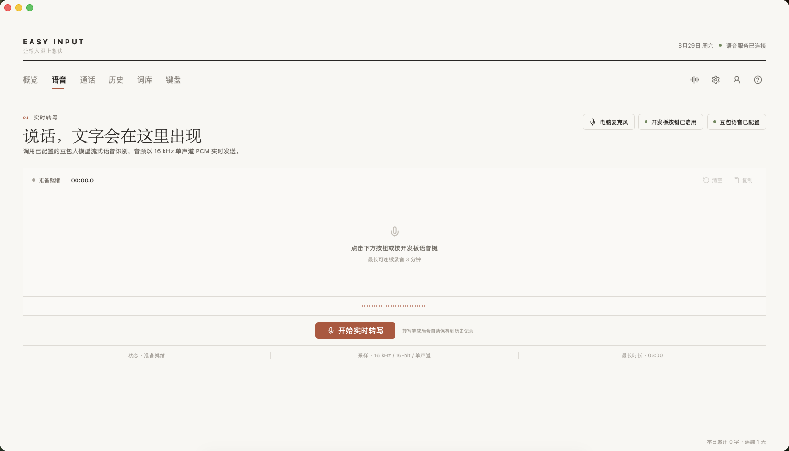
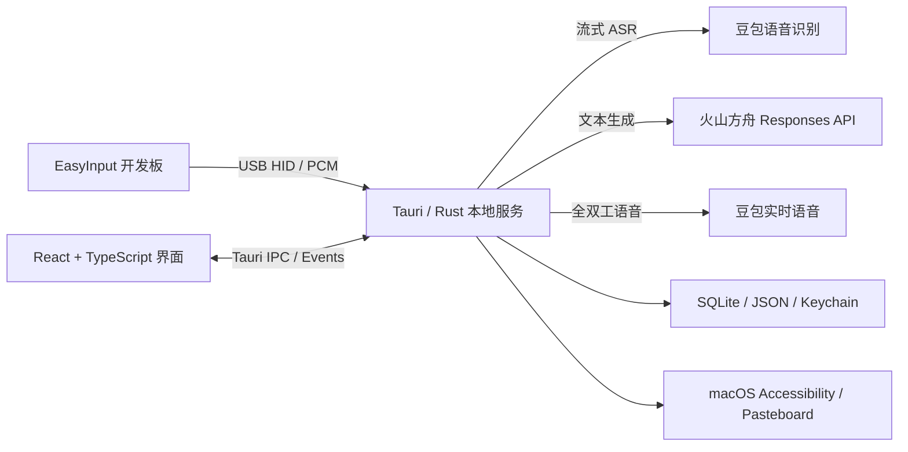

# EasyInput

> 面向 EasyInput AI 键盘的 Intel Mac 桌面客户端：把硬件按键、语音输入、选区语音编辑和实时通话整合为一套原生 macOS 工作流。


当前版本为 `0.1.29`，目标架构为 `x86_64-apple-darwin`，最低支持 macOS 12。

## 项目简介

EasyInput 使用 Tauri 构建本地桌面客户端，通过 USB HID 与开发板交互，并调用豆包语音和火山方舟完成语音识别、实时对话与文本编辑。应用支持在微信、Word 等输入场景中直接写入识别结果；使用语音编辑时，可读取当前选中文字作为上下文，再将翻译、总结或改写结果替换回原选区。

## 核心功能

- **全局语音输入**：按住开发板语音键说话，松开后将识别文字写入当前光标位置。
- **选区语音编辑**：选中文字后说“翻译成英文”“总结这段文字”等指令，模型结果直接替换选区。
- **桌面语音浮窗**：透明圆角浮窗、动态彩带声波、实时转写和处理状态展示。
- **实时语音通话**：开发板麦克风上行、模型语音回复、开发板扬声器播放，支持打断。
- **AI 键盘配置**：管理按键动作、应用启动映射、滚动方向、Wi-Fi 与设备配置同步。
- **词库与历史**：维护热词和替换规则，查询本地输入历史与统计数据。
- **本机安全存储**：配置、词库和历史保存在本机；API Key、Access Token 与 Wi-Fi 密码使用 macOS Keychain。

## 界面预览

| 语音输入 | 实时通话 | 键盘配置 |
|---|---|---|
|  |  |  |

## 技术架构



| 层级 | 技术路线 |
|---|---|
| 桌面外壳 | Tauri 2.11、Rust |
| 产品界面 | React 18、TypeScript、Vite |
| 硬件通信 | USB HID、自定义配置分片、CRC16-CCITT |
| 语音识别 | 豆包流式语音识别 2.0，16 kHz 单声道 PCM |
| 文本编辑 | 火山方舟 Responses API、macOS Accessibility、Pasteboard |
| 实时通话 | 豆包实时语音 3.0、PCM 双向传输 |
| 本地数据 | SQLite、JSON、macOS Keychain |

## 快速开始

### 环境要求

- Intel Mac，macOS 12 或更高版本
- Node.js 18+
- Rust stable 与 `x86_64-apple-darwin` target
- Xcode Command Line Tools

### 安装依赖

```bash
npm install
rustup target add x86_64-apple-darwin
```

### 浏览器开发模式

```bash
npm run dev
```

浏览器模式使用脱敏的本地设备夹具，适合开发界面；USB、Keychain、全局输入和系统权限功能需要在 Tauri 应用中验证。

### 启动原生应用

```bash
npm run tauri:dev
```

首次使用语音输入时，需要在 macOS 系统设置中允许 EasyInput 使用麦克风、辅助功能和输入监控。

## 构建与验证

```bash
# 前端构建与测试
npm run build
npm test -- --run

# Rust 测试
cargo test --manifest-path src-tauri/Cargo.toml

# Intel Mac 发布构建
npm run tauri:build:intel
npm run verify:intel
```

本地调试 `.app`：

```bash
npm run tauri:build:debug:app
```

未配置 Apple Developer ID 时，构建产物仅适合本机开发验证；正式分发还需要 Developer ID 签名与 Apple 公证。

## 本机数据与凭据

应用数据目录：

```text
~/Library/Application Support/pro.easyinput.desktop.intel/
├── config.json
├── dictionary.json
└── history.db
```

以下内容不会写入仓库：

- 豆包语音 Access Token
- 火山方舟 API Key
- 实时语音 API Key
- Wi-Fi 密码
- Apple Developer ID 与签名私钥

敏感凭据由应用写入 macOS 登录钥匙串。后端同时限制模型服务域名，避免将凭据发送到非官方地址。

## 项目目录

```text
easyinput/
├── src/                    # React/TypeScript 产品界面
├── src-tauri/src/          # Rust 本地能力与硬件协议
├── src-tauri/tauri.conf.json
├── docs/                   # 技术方案、教程与实现状态
├── scripts/                # 构建、签名与架构验证脚本
└── screenshots/            # 页面验收截图
```

## 详细文档

- [业务功能技术实现方案](docs/EasyInput-业务功能技术实现方案.md)
- [从零搭建到使用：小白手把手教程](docs/EasyInput-从零搭建到使用-小白手把手教程.md)
- [当前实施状态与外部依赖](docs/IMPLEMENTATION_STATUS.md)

## 当前边界

- 生产发布需要正式的 Developer ID、Apple 公证账户和更新签名密钥。
- USB HID、开发板音频和固件配置需要配合 EasyInput 实板进行端到端验收。
- Wi-Fi 音频只应在可信局域网内使用。
- 当前仓库不包含开发板固件源码。

## License

当前项目尚未附加开源许可证。除非仓库所有者另行授权，保留所有权利。
