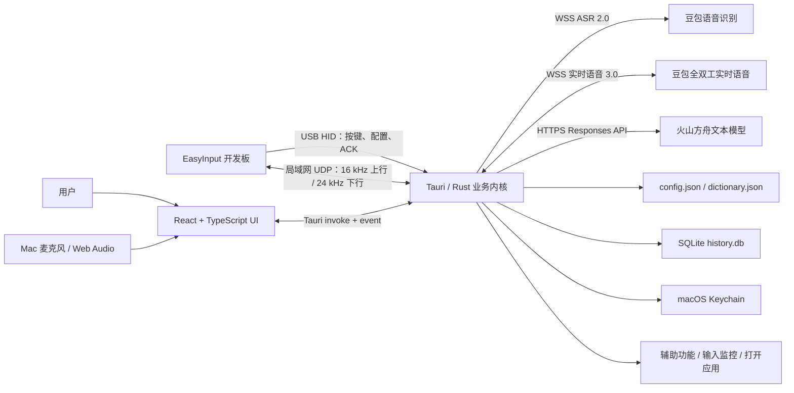
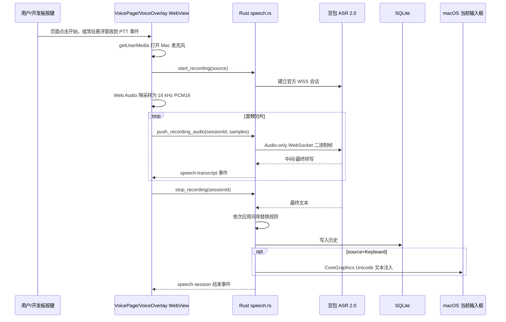
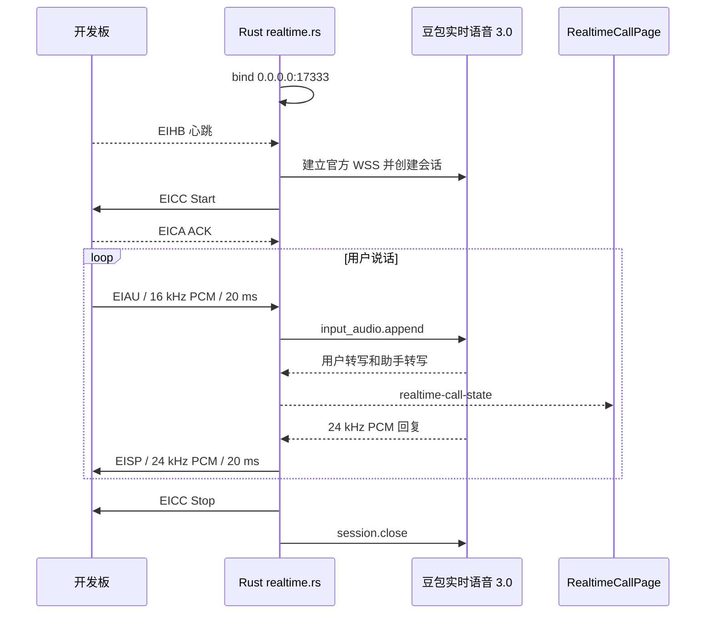

# EasyInput 业务功能技术实现方案

> 文档性质：基于当前源码和本机运行数据形成的技术实现说明，不涉及商业模式、市场、运营或产品定价。
>
> 项目版本：EasyInput `0.1.29`
>
> 基线提交：`908eb01fb4505aea56637d51c06ea46727843d3f`
>
> 现场核对日期：2026-08-29（Asia/Shanghai）
> 项目根目录：`/Users/macforai/Documents/ChatGPT/easyinput`

## 1. 文档结论

本项目最适合继续采用以下技术路线：

**以 macOS 本地优先的 Tauri 桌面客户端为业务中枢，React/TypeScript 负责产品界面和电脑麦克风采集，Rust 负责设备协议、会话状态、云服务连接、系统级文本注入和本地持久化；开发板通过 USB HID 完成按键与配置控制，通过可信局域网 UDP 完成实时音频传输；语音识别、语音对话和文本生成只连接豆包/火山方舟官方接口；配置、词库、历史和密钥分别使用 JSON、SQLite、macOS Keychain 保存。**

这条路线与当前代码高度一致，无须推倒重来。它的核心价值是：

1. 桌面端能直接访问 USB HID、macOS 辅助功能、输入监控、钥匙串和本地网络，这些能力不适合做成纯网页。
2. UI 使用 React，迭代速度快；设备、音频和安全边界放在 Rust，性能和可靠性更可控。
3. 业务数据本地优先，历史、词库和键盘映射不依赖自建后端即可运行。
4. 凭据留在 Keychain，且后端固定官方服务域名，降低 API Key 被界面代码、配置文件或恶意地址窃取的风险。
5. USB 配置和 UDP 音频协议都有明确版本、长度、序列号、CRC 和 ACK，便于与固件联调及定位问题。
6. 当前只为 Intel Mac 发布，`x86_64-apple-darwin` 与 macOS 12 最低版本已经固化，发布目标清晰。

## 2. 项目现状与业务边界

### 2.1 已有业务功能

当前 React 应用提供 10 个业务入口：

| 页面 | 业务作用 | 主要源码 |
|---|---|---|
| 概览 | 当日字数、时长、活动趋势和设备/服务状态 | `/Users/macforai/Documents/ChatGPT/easyinput/src/pages/OverviewPage.tsx` |
| 语音 | 电脑麦克风实时转写、开发板按键触发、语音编辑 | `/Users/macforai/Documents/ChatGPT/easyinput/src/pages/VoicePage.tsx` |
| 通话 | 开发板麦克风 → 豆包实时语音 → 开发板扬声器 | `/Users/macforai/Documents/ChatGPT/easyinput/src/pages/RealtimeCallPage.tsx` |
| 历史 | 转写结果分页、日历统计和删除 | `/Users/macforai/Documents/ChatGPT/easyinput/src/pages/HistoryPage.tsx` |
| 词库 | 热词、替换规则、文本导入导出 | `/Users/macforai/Documents/ChatGPT/easyinput/src/pages/DictionaryPage.tsx` |
| 键盘 | 8 键映射、旋钮、网络、音效、编程助手、固件信息 | `/Users/macforai/Documents/ChatGPT/easyinput/src/pages/KeyboardPage.tsx` |
| 语音服务配置 | 豆包 ASR、火山方舟文本模型、豆包实时语音参数 | `/Users/macforai/Documents/ChatGPT/easyinput/src/pages/SpeechConfigPage.tsx` |
| 设置 | 输入热键、触发方式、悬浮层、外观、麦克风偏好 | `/Users/macforai/Documents/ChatGPT/easyinput/src/pages/SettingsPage.tsx` |
| 账户 | 账号登录界面 | `/Users/macforai/Documents/ChatGPT/easyinput/src/pages/AccountPage.tsx` |
| 帮助 | 使用说明、版本和运行信息 | `/Users/macforai/Documents/ChatGPT/easyinput/src/pages/HelpPage.tsx` |
| 桌面语音悬浮窗 | 常驻监听硬件语音键，显示动态波形、流式文字和写入结果 | `/Users/macforai/Documents/ChatGPT/easyinput/src/components/VoiceOverlay.tsx` |

### 2.2 当前真实能力与占位能力

| 能力 | 当前状态 | 技术说明 |
|---|---|---|
| UI、配置、词库、历史 | 已实现 | 可在本机自动测试和构建 |
| 电脑麦克风流式识别 | 已实现 | WebView 采集，Rust 连接豆包 ASR 2.0 |
| 开发板语音键/编辑键 | 已实现协议和监听 | 需要实板做最终 I/O 验收 |
| 普通语音输入的音源 | **当前是 Mac 麦克风** | 开发板按键只负责触发；`VoicePage.tsx` 始终调用 `getUserMedia` |
| 实时通话的音源/播放 | 开发板麦克风和扬声器 | Rust 通过 UDP 接收 16 kHz PCM、发送 24 kHz PCM |
| USB 配置同步 | 已实现 | VID/PID、Feature Report 分片、CRC、保存 ACK 均已编码 |
| BLE | 产品界面和连接状态模型存在 | 当前核心设备适配实际以 USB HID 为主，BLE 端到端仍需实板验证 |
| 音效同步 | 未完成 | 当前命令明确返回“需连接真实键盘完成端到端验证” |
| 账号登录 | 未接生产接口 | 因缺少正式 Schema，代码不会向未知接口发送密码 |
| 应用自动更新 | 未接生产端点 | 缺少签名公钥和发布端点，不安装未签名更新 |
| 固件更新/OTA | 未实现 | 当前页面只读，不刷写固件 |

必须特别注意：普通“语音输入”和“语音编辑”的 `source=Keyboard/KeyboardEdit` 表示**触发来源和结果去向**，不代表音频来自开发板。当前代码无论点击页面按钮还是按开发板语音键，都会在 WebView 中打开 Mac 麦克风。只有“全双工实时通话”使用开发板音频链路。

## 3. 总体技术架构



### 3.1 分层职责

#### 表现层：React + TypeScript + Vite

- 路径：`/Users/macforai/Documents/ChatGPT/easyinput/src`
- 入口：`/Users/macforai/Documents/ChatGPT/easyinput/src/main.tsx`
- 页面路由和全局事件：`/Users/macforai/Documents/ChatGPT/easyinput/src/App.tsx`
- Tauri IPC 封装：`/Users/macforai/Documents/ChatGPT/easyinput/src/api.ts`
- 共享类型和默认配置：`/Users/macforai/Documents/ChatGPT/easyinput/src/types.ts`
- 主要职责：界面交互、表单状态、电脑麦克风采集、实时转写展示、调用 Rust 命令、监听 Rust 事件。硬件语音键由独立的常驻 `voice-overlay` WebView 处理，不依赖主窗口当前页面。

#### 本地业务层：Tauri 2 + Rust

- 路径：`/Users/macforai/Documents/ChatGPT/easyinput/src-tauri/src`
- 应用启动和命令入口：`/Users/macforai/Documents/ChatGPT/easyinput/src-tauri/src/lib.rs`
- 业务数据模型：`/Users/macforai/Documents/ChatGPT/easyinput/src-tauri/src/model.rs`
- 主要职责：可信状态管理、配置校验、设备发现、云服务鉴权、历史写入、系统权限检查、文本注入、应用启动。

#### 设备适配层

- 设备管理：`/Users/macforai/Documents/ChatGPT/easyinput/src-tauri/src/device.rs`
- 固件配置转换：`/Users/macforai/Documents/ChatGPT/easyinput/src-tauri/src/firmware_config.rs`
- USB 协议：`/Users/macforai/Documents/ChatGPT/easyinput/src-tauri/src/protocol/usb.rs`
- UDP 音频协议：`/Users/macforai/Documents/ChatGPT/easyinput/src-tauri/src/protocol/audio.rs`
- Wi-Fi：`/Users/macforai/Documents/ChatGPT/easyinput/src-tauri/src/wifi.rs`

#### 云能力适配层

- 流式语音识别：`/Users/macforai/Documents/ChatGPT/easyinput/src-tauri/src/speech.rs`
- 实时语音对话：`/Users/macforai/Documents/ChatGPT/easyinput/src-tauri/src/realtime.rs`
- 语音编辑文本模型：`/Users/macforai/Documents/ChatGPT/easyinput/src-tauri/src/ark.rs`

#### 本地数据层

- 存储实现：`/Users/macforai/Documents/ChatGPT/easyinput/src-tauri/src/storage.rs`
- 词库处理：`/Users/macforai/Documents/ChatGPT/easyinput/src-tauri/src/dictionary.rs`
- 配置和词库：版本化 JSON、临时文件写入后原子重命名。
- 历史：SQLite + WAL，支持游标分页、按月聚合和本地时区统计。
- 密钥：macOS Keychain，不进入 JSON、SQLite、`.env` 或前端 LocalStorage。

## 4. 本机环境、路径和具体数据

### 4.1 本机与工具链

| 项目 | 本机实测值 |
|---|---|
| 操作系统 | macOS 26.5.2，Build 25F84 |
| CPU 架构 | `x86_64` |
| CPU | Intel Core i5-1038NG7 @ 2.00 GHz |
| Node.js | `v25.9.0` |
| npm | `11.12.1` |
| Rust | `rustc 1.98.0` |
| Cargo | `cargo 1.98.0` |
| Tauri CLI | `2.11.2` |
| 项目声明版本 | `0.1.29` |
| Tauri 最低系统 | macOS 12.0 |
| 发布架构 | `x86_64-apple-darwin` |

依赖配置位于：

- `/Users/macforai/Documents/ChatGPT/easyinput/package.json`
- `/Users/macforai/Documents/ChatGPT/easyinput/package-lock.json`
- `/Users/macforai/Documents/ChatGPT/easyinput/src-tauri/Cargo.toml`
- `/Users/macforai/Documents/ChatGPT/easyinput/src-tauri/Cargo.lock`
- `/Users/macforai/Documents/ChatGPT/easyinput/src-tauri/tauri.conf.json`

当前项目目录约 `12 GB`，其中 `src-tauri/target` 约 `11 GB`，`node_modules` 约 `129 MB`。空间主要被 Rust 多架构、多配置构建缓存占用，不是业务数据占用。

### 4.2 本机应用数据目录

Tauri 标识符为 `pro.easyinput.desktop.intel`，因此本机数据目录是：

```text
/Users/macforai/Library/Application Support/pro.easyinput.desktop.intel/
├── config.json       6,850 bytes
├── dictionary.json     325 bytes
├── history.db       16,384 bytes
├── history.db-wal  284,312 bytes
└── history.db-shm   32,768 bytes
```

2026-08-29 现场核对时：

- `config.json`：配置 Schema 版本 `4`，全局配置修订号 `70`。
- 键盘配置修订号：`83`。
- `dictionary.json`：8 个热词、2 条替换规则。
- `history.db`：30 条历史，合计 952 字、460,234 ms，即约 7 分 40.234 秒。
- SQLite 开启 WAL，因此进程运行中最近数据可能仍在 `history.db-wal`，不能只复制主数据库文件做热备份。

### 4.3 本机当前非敏感配置快照

以下数据来自本机 `config.json`。凭据值、完整系统提示词和开场白未写入本文档。

```json
{
  "configVersion": 4,
  "configRevision": 70,
  "settings": {
    "inputHotkey": "RightCommand",
    "editHotkey": "RightOption",
    "triggerMode": "Hold",
    "inputMode": "Auto",
    "enterToStop": true,
    "overlayEnabled": true,
    "livePreview": true,
    "overlayPosition": "Bottom",
    "overlayOpacity": 0.7,
    "appearance": "System",
    "microphoneSource": "KeyboardPreferred"
  },
  "keyboard": {
    "revision": 83,
    "targetPlatform": "MacOS",
    "pttMode": "Hold",
    "wifi": {
      "ssid": "HUAWEI-1CRYV0",
      "passwordSaved": true,
      "audioHost": "192.168.3.83",
      "audioPort": 17333
    }
  },
  "speech": {
    "enabled": true,
    "endpoint": "wss://openspeech.bytedance.com/api/v3/sauc/bigmodel",
    "resourceId": "volc.bigasr.sauc.duration",
    "language": "zh-CN",
    "accessTokenSaved": true
  },
  "ark": {
    "enabled": true,
    "endpoint": "https://ark.cn-beijing.volces.com/api/v3/responses",
    "model": "doubao-seed-2-0-lite-260215",
    "apiKeySaved": true
  },
  "realtimeVoice": {
    "enabled": true,
    "endpoint": "wss://openspeech.bytedance.com/api/v3/duplex/realtime/dialogue",
    "model": "1.2.6.1",
    "voice": "zh_male_xiaotian_jupiter_bigtts",
    "speed": 0,
    "loudness": 0,
    "strictAudit": true,
    "enableLoudnessNorm": true,
    "enableUserQueryExit": false,
    "apiKeySaved": true
  }
}
```

本机 `en0` 地址确实为 `192.168.3.83`，与配置的 `audioHost` 一致。实时通话在电脑侧实际绑定 `0.0.0.0:17333`，开发板应向 `192.168.3.83:17333` 发送心跳和音频。

### 4.4 本机键位数据

| 键位 | 当前动作 | 本机数据/下发数据 |
|---|---|---|
| KEY1 | 语音输入 | `voice_ptt_hold` |
| KEY2 | 语音编辑 | `edit_ptt_hold` |
| KEY3 | 复制 | `copy` |
| KEY4 | 粘贴 | `paste` |
| KEY5 | 撤销 | `undo` |
| KEY6 | 打开 VideoFusion-macOS | 本机路径 `/Applications/VideoFusion-macOS.app`；设备只保存 Host Action UUID |
| KEY7 | 打开 CC Switch | 本机路径 `/Applications/CC Switch.app`；设备只保存 Host Action UUID |
| KEY8 | 实时通话 | `hotkey=Ctrl+Shift+R`；客户端将其作为保留组合键消费 |
| 旋钮按下 | 切换滚动方向 | `scroll_axis_toggle` |
| 旋钮滚动 | 垂直、速度 3、不反转 | `axis=vertical, speed=3` |

打开应用时不把本机绝对路径写入固件。固件只保存不透明 UUID，开发板发回 UUID 后，Mac 客户端在本机配置中解析成 `.app` 路径，再调用 `/usr/bin/open`。这样既避免泄漏本机目录，又允许不同电脑为同一个物理键维护不同应用映射。

按当前配置和修复后的实时通话键映射生成、但**不包含 Wi-Fi 密码**的固件 JSON 为 834 bytes，需要 17 个 USB 分片，CRC16-CCITT 为 `0x372B`。真正同步时若从 Keychain 取出 Wi-Fi 密码并加入 JSON，长度、分片数和 CRC 会相应变化；日志和文档不得记录该密码。

### 4.5 本机词库数据

热词共 8 个：

```text
EasyInput
信创云网
叶伟荣
吴敏
姚秋根
邱大山
马燕
邱锦松
```

替换规则共 2 条，按数组顺序执行：

```text
浙江信产 -> 浙江省公众信息产业有限公司
院长     -> 叶伟荣
```

词库技术限制：最多 1,000 个热词；导入文件最大 1 MB；单个热词最多 100 个 Unicode 字符；文件必须是 UTF-8，可带 BOM；空行和重复行会统计并去除。

### 4.6 本机历史数据统计

数据库：`/Users/macforai/Library/Application Support/pro.easyinput.desktop.intel/history.db`

表结构：

```sql
CREATE TABLE history(
  id INTEGER PRIMARY KEY AUTOINCREMENT,
  text TEXT NOT NULL,
  created_at TEXT NOT NULL,
  duration_ms INTEGER NOT NULL,
  char_count INTEGER NOT NULL,
  source TEXT NOT NULL
);
CREATE INDEX idx_history_time ON history(created_at DESC, id DESC);
```

按来源统计：

| 来源 | 条数 | 字数 | 时长 ms |
|---|---:|---:|---:|
| `Keyboard` | 15 | 291 | 112,971 |
| `Computer` | 12 | 547 | 326,525 |
| `KeyboardEdit` | 3 | 114 | 20,738 |
| 合计 | 30 | 952 | 460,234 |

按本地日期统计：

| 日期 | 条数 | 字数 | 时长 ms |
|---|---:|---:|---:|
| 2026-08-29 | 1 | 32 | 18,378 |
| 2026-08-28 | 4 | 193 | 133,575 |
| 2026-08-27 | 18 | 510 | 166,688 |
| 2026-08-26 | 7 | 217 | 141,593 |

`created_at` 以 RFC 3339 UTC 写入，查询今日和月历时通过 SQLite `localtime` 转成本机时区。

### 4.7 Keychain 数据边界

Keychain 不是普通文件路径，使用 Service + Account 定位。Service 统一为：

```text
pro.easyinput.desktop.intel
```

| 凭据 | Account |
|---|---|
| 豆包 ASR Access Token | `doubao-asr-access-token` |
| 火山方舟 API Key | `volcengine.ark.api-key.v1` |
| 豆包实时语音 API Key | `volcengine.realtime-voice.api-key.v1` |
| 键盘 Wi-Fi 密码 | `easyinput.keyboard.wifi-password.v1` |

`config.json` 只保存 `accessTokenSaved/apiKeySaved/passwordSaved` 布尔值。当前四类凭据对应的“已保存”状态均为 `true`，本文档不读取、不展示也不复制具体值。

## 5. 各业务功能的具体实现

### 5.1 应用启动和运行时快照

启动顺序：

1. `src-tauri/src/main.rs` 调用库入口。
2. `src-tauri/src/lib.rs` 安装 Rust TLS provider、初始化 Tauri 和文件对话框插件。
3. 根据 Tauri identifier 取得应用数据目录，并调用 `Storage::open`。
4. SQLite 开启 WAL、外键，并自动创建 `history` 表和索引。
5. 创建 `AppState`，其中保存录音状态、实时通话状态、会话 sender、凭据内存缓存和设备管理器。
6. 启动 USB HID 后台监听线程。
7. 创建托盘图标；关闭主窗口时只隐藏，点击托盘图标重新显示。
8. 前端调用 `get_runtime_snapshot`，一次取得版本、服务状态、录音状态、设备能力、设置、键盘配置和今日统计。

状态边界使用四类标识避免异步结果串线：

- `sessionId`：隔离语音和实时通话会话。
- `operationId`：标识每次命令成功/失败结果。
- `revision`：标识设置与键盘配置版本。
- `endpointEpoch`：设备端点代次，避免重连后把旧设备结果应用到新连接。

### 5.2 普通语音输入



关键数据：

- WebView 调用 `navigator.mediaDevices.getUserMedia`，请求单声道、回声消除、降噪和自动增益。
- 当前使用 `ScriptProcessorNode(4096, 1, 1)` 取得 Float32 音频。
- 前端按输入采样率做平均降采样，转换为 16 kHz、16-bit、单声道 PCM。
- Rust 单次最多接受 16,000 个 `i16` 样本，即最多 1 秒，防止异常 IPC 包占用过多内存。
- 页面最长录音 180,000 ms，即 3 分钟。
- 云端地址固定为 `wss://openspeech.bytedance.com/api/v3/sauc/bigmodel`。
- 当前 Resource ID 为 `volc.bigasr.sauc.duration`。
- 初始请求使用 JSON + gzip，后续发送带序列号的音频帧。
- Rust 用 `sessionId` 丢弃过期分片和过期停止请求。

结果处理规则：

- `Computer`：显示结果并写历史，不自动写入其他应用。
- `Keyboard`：显示结果、写历史，并通过 macOS CoreGraphics 写入当前光标位置。
- 文本注入每次最多发送 20 个 UTF-16 code units，分片间隔 3 ms，避免长文本事件过大。
- 没有辅助功能权限时，识别结果仍可得到，但自动写入会失败并返回明确错误。

硬件按键的全局输入由第二个 Tauri 窗口 `voice-overlay` 承担。该窗口在应用启动时即加载但默认隐藏，因此即使主窗口停留在概览、设置页面或已经隐藏，硬件事件仍有稳定的 WebView 接收者。开始录音时它显示在当前屏幕下方，具有透明、无边框、始终置顶、跨工作区、不可聚焦和鼠标穿透属性，不会抢走微信、Word 等目标应用的输入焦点。悬浮窗使用 SVG 折线显示最近 52 个音量采样点，并将 `speech-transcript` 的临时识别文本横向滚动到最新位置；会话结束后显示写入结果并自动隐藏。

对应文件：

- `/Users/macforai/Documents/ChatGPT/easyinput/src/components/VoiceOverlay.tsx`
- `/Users/macforai/Documents/ChatGPT/easyinput/src/voice-overlay.css`
- `/Users/macforai/Documents/ChatGPT/easyinput/src-tauri/tauri.conf.json`
- `/Users/macforai/Documents/ChatGPT/easyinput/src-tauri/capabilities/default.json`

技术改进建议：`ScriptProcessorNode` 已属于旧 Web Audio API，后续应迁移到 `AudioWorkletNode`，将重采样和 PCM 打包放入 AudioWorklet，减少主线程抖动和 UI 卡顿。

### 5.3 语音编辑

语音编辑复用普通 ASR 流程，但在按下编辑键时增加上下文获取和文本生成：

1. USB 报告识别 `EasyInputEdit`、Right Option 或兼容的 Ctrl+Shift+E。
2. Rust 通过 macOS Accessibility API 读取当前 `AXFocusedUIElement` 的 `AXSelectedText`。
3. 前端仍使用 Mac 麦克风采集问题，来源标记为 `KeyboardEdit`。
4. 豆包 ASR 把问题转成文本。
5. Rust 调用火山方舟 Responses API：`https://ark.cn-beijing.volces.com/api/v3/responses`。
6. 当前模型为 `doubao-seed-2-0-lite-260215`，`store=false`，最大输出 2,048 tokens。
7. 选中文本放入 `<context>`，语音问题放入 `<voice_request>`，两者明确区分，降低选中文本被当作系统指令的风险。
8. 模型回答通过 CoreGraphics 写回；有选区时通常由系统输入行为替换选区，无选区时写在光标处。
9. 最终结果以 `KeyboardEdit` 来源写入历史。

这条链路的优势是“识别”和“理解/改写”解耦：ASR 只负责把口语变成问题，文本模型只处理文字上下文，出错时更容易判断是录音、识别、模型还是系统写入问题。

### 5.4 键盘配置和 USB HID 同步

硬件标识和报告：

| 参数 | 值 |
|---|---|
| USB VID | `0x303A` |
| USB PID | `0x1006` |
| 配置 Report ID | `0x10` |
| App Command Report ID | `0x11` |
| Agent Report ID | `0x12` |
| Status Report ID | `0x13` |
| Speaker Request/Response | `0x14` / `0x15` |
| 兼容键盘 Report ID | `0x01` |

配置同步过程：

1. 前端编辑 `KeyboardConfig` 并调用 `push_ai_keyboard_config`。
2. Rust 检查必须恰好 8 个按键；打开应用动作必须指向存在的 `.app` 目录。
3. Wi-Fi SSID 最长 32 bytes；WPA 密码必须为 8–63 bytes，开放网络留空。
4. Wi-Fi 密码写入 Keychain，不保存在普通配置文件。
5. `firmware_config.rs` 把 UI 模型转换成固件 `ai_keyboard.v1` JSON。
6. 打开应用动作只下发 `host_action:<uuid>`，应用绝对路径只保留在 Mac。
7. JSON 最大 2,048 bytes，按 52 bytes 数据分片。
8. 每个分片编码成固定 64-byte USB Feature Report。
9. 所有分片携带总长度和同一个 CRC16-CCITT；标准测试向量 `123456789` 的 CRC 是 `0x29B1`。
10. 固件完成保存后通过 App Command 返回 bytes、CRC、`ok` 和 `saved`。
11. 客户端最多等待 4 秒；只有长度和 CRC 匹配且 `ok=true, saved=true` 才报告成功。

Feature Report 布局：

```text
byte 0      Report ID = 0x10
byte 1..3   Magic = "S3C"
byte 4      协议版本 = 1
byte 5      分片 index
byte 6      分片 total
byte 7..8   JSON 总长度（LE u16）
byte 9      当前 payload 长度
byte 10..11 CRC16-CCITT（LE u16）
byte 12..63 payload，最多 52 bytes
```

保存顺序是“先保存本机配置，再同步设备”。因此设备同步失败时不会丢失用户刚编辑的配置，错误会明确表述为“配置已保存在本机，但未同步到设备”。

### 5.5 开发板按键和本机动作

应用启动后，Rust 后台线程每 2 秒重新发现一次 VID/PID 匹配设备。发现设备后持续读取 HID 报告，并做以下处理：

- `EasyInputVoice`：发出 `hardware-voice-button` Tauri 事件。
- `EasyInputEdit`：读取选中文本并发出 `hardware-edit-button`。
- `Ctrl+Shift+R` 普通键盘报告：发出 `hardware-realtime-button`；新版固件若发送 `EasyInputRealtime` App Command 也继续兼容。
- 固定文本：按 index/total 重组 UTF-8，再注入当前输入框。
- Host Action：解析 UUID，在本机配置中查找路径，再调用 `/usr/bin/open`。
- 配置 ACK：交给等待同步命令的条件变量。

相同 App Report 在 120 ms 内会被去重；语音、编辑和实时通话事件分别维护递增 sequence，React 端也记录已经处理的 sequence，避免重复按键导致重复启动会话。

### 5.6 全双工实时语音



电脑侧具体流程：

1. 绑定 `0.0.0.0:<audioPort>`，本机当前端口为 `17333`。
2. 最多等待 7 秒，直到收到合法 `EIHB` 心跳；心跳来源地址成为本次会话 peer。
3. 连接固定官方地址 `wss://openspeech.bytedance.com/api/v3/duplex/realtime/dialogue`。
4. 使用固定协议模型 `1.2.6.1` 创建会话。
5. 向开发板发送 `EICC Start`，最多等待 3 秒的 `EICA` 确认。
6. 只接受 peer IP 发来的合法音频，解析 session、sequence、采样率和帧长度。
7. 云端返回的音频累积为 960-byte 帧，每 20 ms 向开发板扬声器发送一次。
8. 用户点击打断时发送 `response.cancel`。
9. 1 秒没有上行音频时向云端提交 mute；新音频到达时提交 unmute，避免无效空音频持续占用会话。
10. 停止时同时通知开发板和云端，等待最多 3 秒后收尾。

音频协议具体数据：

| 方向 | Magic | 采样率 | 每帧样本 | PCM | 头部 | 整包 |
|---|---|---:|---:|---:|---:|---:|
| 开发板 → Mac | `EIAU` | 16,000 Hz | 320 | 640 bytes | 32 bytes | 672 bytes |
| Mac → 开发板 | `EISP` | 24,000 Hz | 480 | 960 bytes | 32 bytes | 992 bytes |

每帧都是 20 ms、16-bit、单声道 PCM。控制协议使用 `EICC`，ACK 使用 `EICA`，心跳使用 `EIHB`。线上的 session id 是从 UUID 派生的 `u64`，各方向另有 `u32` sequence。

该方案选择 UDP 而不是把音频塞进 USB Feature Report，优势是吞吐高、延迟低、不会让 HID 控制通道承担连续媒体流；代价是必须处于可信局域网，并需要做好来源绑定、序列检查、超时和丢包诊断。

### 5.7 历史、概览和词库

历史分页采用 `id < cursor ORDER BY id DESC LIMIT ?`，默认 20 条，限制在 1–100 条。相比 offset 分页，新增数据时不容易造成翻页重复或遗漏。

概览的当日统计由 SQLite 动态聚合：

```sql
SELECT COALESCE(SUM(char_count), 0),
       COALESCE(SUM(duration_ms), 0)
FROM history
WHERE date(created_at, 'localtime') = date('now', 'localtime');
```

词库在两个阶段生效：

- 热词随 ASR 初始请求序列化为识别上下文，提高专有名词命中率。
- 替换规则在每次服务端转写文本到达后按配置顺序执行，可修正稳定的同音误识别。

JSON 配置写入采用 `*.tmp` + rename，避免应用崩溃时留下半个 JSON。配置版本高于客户端支持版本时进入保护模式，不自动覆盖未来版本的数据。

### 5.8 浏览器预览与原生运行

`src/api.ts` 通过 `__TAURI_INTERNALS__` 判断是否运行在 Tauri：

- 浏览器模式：返回脱敏 mock runtime，词库和语音配置可使用 LocalStorage，便于快速开发 UI。
- Tauri 模式：通过 `invoke` 调用 Rust，使用真实 Keychain、SQLite、USB、系统权限和官方云服务。
- Tauri 启动两个 WebView：`main` 是管理界面；`voice-overlay` 是默认隐藏、不可聚焦的全局语音控制器。浏览器预览模式不创建原生悬浮窗。

浏览器中的“ConnectedBle”、固件版本 `0.4.53`、SSID 和应用列表可能是开发夹具，不能作为实板验收证据。涉及鉴权测试、配置同步、USB、Keychain、系统写入和实时通话时，必须使用 `npm run tauri:dev`。

## 6. 安全和隐私设计

### 6.1 已有措施

1. ASR、实时语音和方舟 endpoint 由 Rust 校验为固定官方地址，拒绝把凭据发送到自定义域名。
2. Access Token、API Key 和 Wi-Fi 密码保存在 Keychain。
3. Tauri CSP 限制连接源，生产页面不能任意连接外部站点。
4. 语音会话使用 `sessionId`，过期分片和停止请求被拒绝。
5. 固件配置有大小限制、分片元数据、CRC 和保存 ACK。
6. App 路径不下发设备，只下发 UUID。
7. 账号 Schema 未知时安全失败，不猜测接口。
8. 更新签名未配置时安全失败，不安装未知更新。

### 6.2 仍需处理的风险

- `history.db` 和 `dictionary.json` 当前是本机明文，任何拥有当前用户文件读取权限的进程都能读取。若历史包含敏感内容，应增加“关闭历史”“定期清理”和可选数据库加密。
- Wi-Fi 音频 token 当前不是密码学认证，只适用于可信局域网。生产增强方案可采用每次会话随机 nonce + HMAC，或在局域网链路上增加 DTLS/QUIC。
- 当前 `voiceService=Connected` 只表示配置启用且 Token 保存，不等于刚完成真实网络探活。UI 应把“已配置”和“在线”拆成两个状态。
- 开发日志必须避免打印 Key、Token、Wi-Fi 密码、完整系统提示词和完整用户转写。
- 发布前必须配置 Developer ID、公证账户和更新签名公钥。

## 7. 构建、测试和发布路径

### 7.1 本地开发

```bash
cd /Users/macforai/Documents/ChatGPT/easyinput
npm install
npm run dev
```

浏览器开发地址由 Vite 提供，只适合 UI 和 mock 数据验证。

原生功能开发：

```bash
cd /Users/macforai/Documents/ChatGPT/easyinput
npm run tauri:dev
```

### 7.2 自动验证

```bash
cd /Users/macforai/Documents/ChatGPT/easyinput
npm test
cargo test --manifest-path /Users/macforai/Documents/ChatGPT/easyinput/src-tauri/Cargo.toml
npm run build
```

2026-08-29 本机结果：

- Vitest：2 个测试文件，6 个测试通过，0 失败。
- Rust：37 个测试通过，0 失败，1 个需要访问豆包端点的手工网络诊断测试默认忽略。
- TypeScript + Vite：构建成功，转换 1,607 个模块。
- `dist/index.html`：0.45 kB，gzip 0.29 kB。
- `dist/assets/index-*.css`：47.15 kB，gzip 9.92 kB。
- `dist/assets/index-*.js`：274.91 kB，gzip 83.80 kB。
- 当前有若干 Rust dead-code warning，不影响测试通过，但发布前建议清理或用明确注释收口。

### 7.3 Intel 构建

```bash
cd /Users/macforai/Documents/ChatGPT/easyinput
rustup target add x86_64-apple-darwin
npm run tauri:build:intel
npm run verify:intel
```

目标配置：

- 应用：`EasyInput.app`
- 安装包：`EasyInput_0.1.29_x64.dmg`
- 架构：仅 `x86_64`
- 最低系统：macOS 12.0
- Bundle identifier：`pro.easyinput.desktop.intel`

本机已存在的安装包：

```text
/Users/macforai/Documents/ChatGPT/easyinput/src-tauri/target/x86_64-apple-darwin/release/bundle/dmg/EasyInput_0.1.29_x64.dmg
```

该文件大小为 5,695,731 bytes，修改时间为 2026-08-26 16:31:53 +0800。它早于当前工作区修改和 2026-08-29 的验证，**不能视为当前源码的最新发布包**。应在处理当前未提交修改、完成实板验收并配置签名后重新构建。

## 8. 建议的落地实施顺序

### 阶段一：冻结接口和状态模型

1. 保持 `RuntimeSnapshot`、`RecordingState`、`RealtimeCallState` 为前后端唯一状态契约。
2. 明确 `Computer/Keyboard/KeyboardEdit` 是触发与结果来源，不再让字段名暗示硬件音源。
3. 增加独立 `AudioSource=MacMicrophone/KeyboardUdp`，为普通语音输入切换开发板麦克风做准备。

验收标准：前后端 TypeScript/Rust 字段一致，所有命令失败都返回 `operationId + message`，过期 session 不能改变当前 UI。

### 阶段二：完成普通语音主链路

1. 将 Web Audio 的 `ScriptProcessorNode` 迁移到 `AudioWorkletNode`。
2. 统一 16 kHz PCM 分帧策略，建议 20–100 ms/帧。
3. 增加网络断线、Keychain 超时、麦克风权限和 3 分钟自动停止测试。
4. 把“已配置”和“真实在线”状态拆开。

验收标准：连续录音 3 分钟不崩溃；断网后能明确失败并回到可重试状态；同一时间只能存在一个普通语音会话。

### 阶段三：实板验收 USB 和键盘动作

1. 验证真实设备枚举为 VID `0x303A` / PID `0x1006`。
2. 验证 834-byte 无密码配置与含密码配置的分片、CRC、ACK。
3. 验证 Hold/Toggle、语音键、编辑键、实时通话键。
4. 验证两个 OpenApp UUID 能分别打开本机目标应用。
5. 验证拔插、重复报告、固件拒绝、4 秒超时和旧固件兼容报告。

验收标准：设备保存后重启仍保留配置；CRC 或长度不一致时客户端绝不报告成功。

### 阶段四：实板验收实时通话

1. 确保开发板与 Mac 位于 `HUAWEI-1CRYV0`，开发板目标为 `192.168.3.83:17333`。
2. 依次验证 `EIHB → EICC Start → EICA → EIAU/EISP → EICC Stop`。
3. 记录首包延迟、首字延迟、首个扬声器包延迟、丢包数、乱序数和连续通话时长。
4. 验证 7 秒无心跳、3 秒无 ACK、错误 session、错误来源 IP、错误采样率和错误帧长。
5. 验证模型讲话时用户打断，以及 1 秒无输入后的 mute/unmute。

验收标准：开发板扬声器无明显持续卡顿；错误包不进入云端；停止后 UDP、WSS 和状态都能清理。

### 阶段五：补齐发布外部依赖

1. 获取正式账号 API Schema 和测试账号，再实现 login/logout。
2. 获取 Developer ID Application、Notarization 配置。
3. 配置更新 manifest、签名私钥离线保管和客户端公钥。
4. 决定音效格式、转码参数、A/B 分区提交协议后实现音效同步。
5. 在 macOS 12 Intel 真机或 CI runner 上做最低系统测试。

## 9. 这条技术路线的优势

### 9.1 相比纯 Web 应用

- 能稳定访问 HID、UDP、本地应用目录、Accessibility、CoreGraphics 和 Keychain。
- 可以在用户当前使用的任意应用中写入文字，而不局限于浏览器页面。
- 历史与词库本地可用，不需要为了保存少量个人数据搭建账号后端。

### 9.2 相比 Electron 全栈 JavaScript

- Tauri 使用系统 WebView，当前前端产物只有约 300 kB 级，运行包和内存基线通常更小。
- Rust 更适合处理字节协议、CRC、HID、UDP、线程和系统 FFI。
- 密钥和系统级操作不暴露为普通 Node.js API，安全边界更集中。

### 9.3 相比把所有能力放进固件

- 云鉴权、模型升级、词库、提示词和历史留在 Mac，修改不需要刷固件。
- 固件只承担稳定的按键、音频和配置存储，职责更小。
- 本机应用路径只在 Mac 保存，固件配置具有跨电脑可迁移性。

### 9.4 相比自建语音中转后端

- 当前个人/单机使用可以直接连接官方端点，减少服务器成本、运维和隐私责任。
- 音频无需先经过自有服务器，链路更短。
- 通过 Rust 固定官方 endpoint，仍能控制凭据外泄风险。

如果未来需要多端账号、用量计费、团队词库、设备远程管理或集中审计，可以在现有本地优先架构外增加一个薄的业务后端；不建议为了这些未来能力把当前 HID、音频和文本注入逻辑搬离本机。

## 10. 当前结论和发布判定

当前源码已经形成可工作的技术闭环：React UI → Tauri IPC → Rust 会话/协议 → 官方云服务 → 本地数据/系统输入；自动化测试和前端构建均通过。本机也已经产生真实历史、词库、键位和云服务配置数据，说明并非只有静态页面。

但当前还不应直接判定为“生产发布完成”，原因是：

1. 系统已识别 `EasyInput AI` 实板，VID `0x303A` / PID `0x1006`；实时通话键原先下发了固件无法转换为 HID 键码的 `EasyInputRealtime`，现已改为保留组合键 `Ctrl+Shift+R`，仍需在键盘页面重新同步并完成按键到会话的现场复验。
2. 普通语音输入的开发板按键目前只触发 Mac 麦克风，不是开发板麦克风采集。
3. 音效同步、账号协议、签名更新和固件更新尚未完成。
4. 现有 DMG 早于当前源码修改，必须重新打包、签名和验证。
5. 工作区当前存在未提交修改，应先审查并形成明确提交，再生成发布候选包。

因此最合理的判断是：**技术路线正确，桌面端核心业务已实现；下一步重点不是更换架构，而是实板协议验收、普通语音音源语义收口、发布签名和外部接口补齐。**
