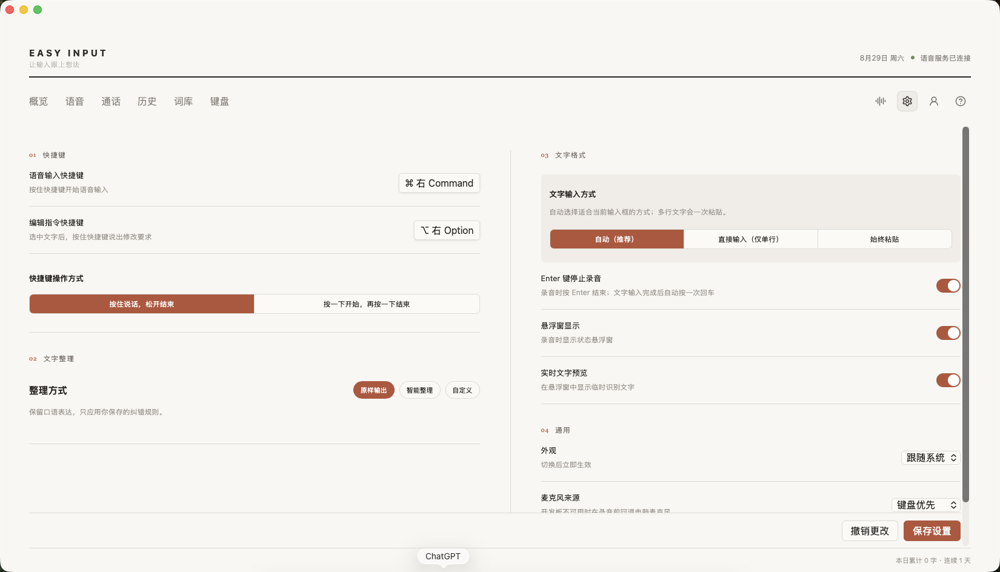

# EasyInput 从零搭建到使用：小白手把手教程

> 适用版本：EasyInput Intel Mac 客户端 0.1.29、EasyInput Maker 固件、EasyInput V2.0 / ESP32-S3、ESP-IDF 5.5.5。
>
> 这份教程的目标不是让你“看懂一些名词”，而是让你从一台准备好的 Intel 芯片 Mac 出发，能够把客户端跑起来、把固件编译出来、在确认设备后烧录、完成语音服务和键盘配置，最后在 Word、微信等文字输入场景里真正用起来。
>
> 文中的客户端图片来自 2026 年 8 月 29 日实际运行的 Intel Mac 版本。涉及服务凭据的画面已经隐藏本机配置值，照着操作时请填写你自己控制台里的参数。

## 1. 先用大白话理解：这到底是个什么项目

EasyInput 不是一个单独的网页，也不是一块只会发快捷键的键盘。完整系统由四层组成：

```text
你看到和点击的页面
        ↓
Mac 客户端的本机能力：保存配置、访问钥匙串、读写 HID、调用麦克风
        ↓
EasyInput V2.0 开发板固件：读取 8 个按键和旋钮、采集声音、播放声音
        ↓
火山引擎云服务：豆包语音识别、火山方舟文本模型、豆包实时语音
```

可以把它想成一家餐厅：React 页面是前台，Rust 后端是后厨，ESP32-S3 开发板是服务员手里的设备，豆包和火山方舟是外部供应商。前台按钮做得再漂亮，如果后厨、开发板或云服务没有接通，完整功能仍然不能工作。

### 1.1 客户端负责什么

客户端运行在 Intel 芯片 Mac 上，采用 Tauri 2 + React + TypeScript + Rust：

- React 和 TypeScript 负责页面、按钮、表单和状态显示。
- Rust 负责 USB HID、macOS 钥匙串、本机文件、SQLite 历史记录、系统权限和云端 WebSocket。
- Tauri 把网页界面和 Rust 本机能力装进一个真正的 macOS 应用 `EasyInput.app`。

客户端主要页面包括概览、语音、通话、历史、词库、键盘、设置、账户和帮助。键盘页面下面又分为按键、麦克风、网络、音效、编程助手和键盘更新。


*图 1：客户端概览页。顶部是主要功能入口，右上角是语音服务、客户端设置、账户和帮助，页面主体用于查看输入量和使用趋势。*

### 1.2 固件负责什么

固件运行在 EasyInput V2.0 的 ESP32-S3 上，主要负责：

- 读取 8 个实体按键和旋转编码器。
- 通过 USB HID 或 BLE 把按键动作发给电脑。
- 接收客户端同步的按键、Wi-Fi 和音频配置。
- 采集板载麦克风，把 16 kHz PCM 音频发给电脑。
- 接收电脑回传的 24 kHz PCM，在板载扬声器播放实时语音回复。
- 播放开机音效和三首本地歌曲。

### 1.3 云服务负责什么

三个服务的凭据不能混用：

| 功能 | 需要的凭据 | 用来做什么 |
| --- | --- | --- |
| 豆包语音识别 2.0 | App Key、Access Token、Resource ID | 把声音变成文字 |
| 火山方舟文本模型 | Ark API Key、模型 ID | 根据语音问题和选中文本生成回答 |
| 豆包实时语音 | 新版豆包语音控制台生成的原始 Realtime API Key | 实时听你说话并用声音回答 |

实时语音 API Key 不能填写语音识别 Access Token、App ID、Resource ID 或 Ark API Key。它们长得都像一串字符，但用途不同。

## 2. 这个项目是怎样一步一步开发出来的

这一章讲“做项目的思路”。如果你以后想增加新功能，这一章比只会复制命令更重要。

### 2.1 第一步：先把截图拆成页面和状态

最开始不是立刻写硬件代码，而是先根据页面截图拆出：顶部导航、概览、语音、历史、词库、键盘设置等页面。每个页面还要考虑不同状态，例如设备已连接、设备未连接、正在同步、同步失败和无硬件预览。

页面入口在 `src/App.tsx`，具体页面在 `src/pages/`，通用按钮和开关在 `src/components/`，样式分布在 `src/*.css`。这样做的好处是：改语音页面不会把键盘页面全部搅乱。

### 2.2 第二步：先定义数据长什么样

页面之间要传递设置，Rust 还要把设置保存下来，因此先在 `src/types.ts` 和 `src-tauri/src/model.rs` 中定义同一套数据结构。例如：设备状态、8 个按键、旋钮设置、Wi-Fi、语音识别配置、火山方舟配置和实时语音配置。

这一步像先统一表格格式。前端叫 `appKey`，Rust 通过序列化规则也能正确理解；如果两边字段名或类型不一致，页面可能显示正常，但保存时就会失败。

### 2.3 第三步：把普通配置和秘密分开保存

普通配置、词库和历史保存在：

```text
~/Library/Application Support/pro.easyinput.desktop.intel/
  config.json
  dictionary.json
  history.db
```

其中 `history.db` 是 SQLite 数据库。Access Token、Ark API Key、实时语音 API Key 和 Wi-Fi 密码不写入这些文件，而是保存到 macOS 登录钥匙串。这样即使有人拿到 `config.json`，也看不到这些敏感内容。

### 2.4 第四步：打通客户端和开发板的 USB HID

客户端和固件约定同一组 USB 身份：VID `0x303A`，PID `0x1006`，产品名 `EasyInput AI`。客户端用 `hidapi` 找设备，固件用 TinyUSB 提供键盘、鼠标和厂商自定义报告。

按键配置最多 2048 字节。客户端把配置拆成每片 52 字节的小包，加上序号和 CRC16 校验，再通过 Feature Report 发给固件。固件保存完成后返回确认包。这样即使 USB 中途断开，也不会把半份配置当成完整配置使用。

### 2.5 第五步：实现普通语音输入

普通语音输入的链路是：

```text
按住语音键或点击“开始实时转写”
→ 客户端开始采集麦克风
→ 发送 16 kHz、单声道、PCM S16LE 音频
→ 豆包语音识别 2.0 返回文字
→ 客户端把文字写入当前光标位置
→ 保存一条本机历史记录
```

词库中的热词会序列化到 ASR 2.0 的 `request.context`，用于提高专有名词的识别概率；替换规则会在识别结果回来后做确定性替换。热词是“提高概率”，替换规则才是“只要匹配就替换”。

### 2.6 第六步：实现语音编辑

语音编辑比语音输入多了一步火山方舟模型调用：

- 没有选中文字时：把你说的话当作问题，模型回答后输入到当前光标位置。
- 有选中文字时：把选中文字作为上下文，再把你说的话当作要求；模型回答后替换原来的选区。

因此语音编辑需要辅助功能权限。客户端只有获得这个权限，才能读取 Word、微信等应用里的选区，并把最终文本写回去。

### 2.7 第七步：实现全双工实时语音

实时语音不是“先录完再识别”，而是一边说、一边听、一边播放回复：

```text
开发板麦克风 16 kHz PCM
→ 局域网发给 Mac 客户端
→ 客户端通过 WebSocket 发给豆包实时语音
→ 豆包返回 24 kHz PCM
→ 客户端发回开发板
→ 开发板扬声器播放
```

开发板和电脑必须连接同一个可信局域网。固件的麦克风上行使用本地网络协议，不应该暴露到互联网或不可信 Wi-Fi。

### 2.8 第八步：处理 macOS 权限和签名

macOS 会分别管理麦克风、辅助功能、输入监控、蓝牙和本地网络权限。它还会根据应用身份判断“这是不是上次授权的那个应用”。因此调试应用也要使用稳定的 Bundle ID 和本地签名，否则每次重编译都可能反复弹权限或钥匙串确认。

项目中的 `scripts/sign-local-app.sh` 会给调试二进制和 `.app` 做本机签名，并保持标识符 `pro.easyinput.desktop.intel`。

### 2.9 第九步：测试、实板验证和持续修正

这个项目把证据分成四档：

1. 前端测试通过，只能证明页面逻辑没有明显回归。
2. Rust 测试通过，只能证明本机逻辑和协议测试通过。
3. ESP-IDF 构建成功，只能证明固件能生成镜像。
4. 烧录后在真实开发板观察成功，才证明本次硬件功能真的工作。

“编译成功”不等于“烧录成功”，“烧录成功”也不等于“功能已经在板上正常运行”。

## 3. 开始复现前要准备什么

### 3.1 硬件

- 一台 Intel 芯片 Mac，项目最低目标为 macOS 12。
- EasyInput V2.0 开发板，也可能标为 AI Keyboard V2.1。
- 一根支持数据传输的 USB 线。只供电的充电线不行。
- 可用的 2.4 GHz Wi-Fi。实时语音时，开发板和电脑要在同一网络。

### 3.2 软件

- Git。
- Node.js 和 npm。当前开发机使用 Node.js 25.9.0、npm 11.12.1；复现时优先使用当前 Node.js LTS，并以 `npm install` 能正常完成为准。
- Rust stable 工具链，目标架构 `x86_64-apple-darwin`。
- Xcode Command Line Tools。
- ESP-IDF 5.5.5，包含 ESP32-S3 工具链。

### 3.3 先检查自己的 Mac

打开“终端”，逐条运行：

```bash
uname -m
xcode-select -p
node --version
npm --version
rustc --version
cargo --version
```

`uname -m` 对 Intel Mac 应显示 `x86_64`。如果 `xcode-select -p` 报错，可运行：

```bash
xcode-select --install
```

然后在系统弹窗中完成安装。

Rust 尚未安装时，按 Rust 官方方式安装 `rustup`，完成后运行：

```bash
rustup target add x86_64-apple-darwin
```

## 4. 下载和认识源码

完整系统有两个源码目录，不要混在一起：

```text
easyinput/                 Mac 客户端
easy-input-maker/          ESP32-S3 固件
```

如果你已经拿到了本项目文件夹，可以直接进入客户端目录。如果从代码仓库重新下载，命令形式如下，请先把地址换成真实地址：

```bash
git clone 这里替换成客户端仓库地址 easyinput
git clone https://github.com/david3832024-coder/easy-input-maker.git
```

客户端主要目录：

```text
easyinput/
  src/                     React 页面和前端逻辑
  src-tauri/src/           Rust 本机能力
  src-tauri/               Tauri、权限和打包配置
  scripts/                 开发启动、签名和 Intel 架构校验脚本
  docs/                    项目文档
  package.json             前端依赖和常用命令
```

固件主要目录：

```text
easy-input-maker/
  main/                    ESP32-S3 应用入口和硬件适配
  components/keyboard/     可在电脑测试的键盘逻辑
  features/                音乐播放器、声音资源等功能
  host_test/               不连接开发板也能运行的测试
  docs/                    硬件安全、烧录和协议文档
  sdkconfig.defaults       默认 ESP-IDF 配置
```

## 5. 第一次运行 Mac 客户端

### 5.1 安装依赖

```bash
cd easyinput
npm install
```

项目有 `package-lock.json`，因此 npm 会尽量安装项目锁定的版本。第一次安装需要联网，完成后会出现 `node_modules`。

### 5.2 先跑前端页面

```bash
npm run dev
```

终端会显示一个本机地址，通常是 `http://127.0.0.1:1420`。浏览器模式使用模拟数据，适合检查页面，不会真的访问 USB HID、钥匙串或硬件麦克风。

结束时回到终端按 `Control + C`。

### 5.3 再跑真正的 Tauri 客户端

```bash
npm run tauri:dev
```

第一次 Rust 编译会下载和编译许多依赖，等待几分钟是正常的。看到 EasyInput 窗口后，说明 React 页面已经装进原生应用，前端可以调用 Rust 本机能力。

如果应用打开后是白屏，先看运行 `npm run tauri:dev` 的终端里有没有报错。不要同时启动多份客户端；可以先完全退出旧进程，再重新运行。

## 6. 测试和构建可运行的客户端

### 6.1 前端测试

```bash
npm test
```

看到测试文件全部 passed 才算通过。

### 6.2 Rust 测试

```bash
cargo test --manifest-path src-tauri/Cargo.toml
```

带 `ignored` 的网络诊断测试默认不执行，这是正常现象。

### 6.3 前端生产构建

```bash
npm run build
```

它会先运行 TypeScript 类型检查，再让 Vite 生成 `dist/`。

### 6.4 构建本机可运行的调试版 App

```bash
npm run tauri:build:debug:app
```

这个命令会完成前端构建、Rust 编译、生成 `.app` 和本机签名。产物通常在：

```text
src-tauri/target/debug/bundle/macos/EasyInput.app
```

可以在 Finder 中双击，也可以在项目目录运行：

```bash
open src-tauri/target/debug/bundle/macos/EasyInput.app
```

### 6.5 构建纯 Intel 发布产物

```bash
npm run tauri:build:intel
npm run verify:intel
```

校验通过时会明确显示二进制架构是 `x86_64`。没有 Apple Developer ID 和公证账户时，这仍是本机或开发测试包，不是可以直接分发给所有人的正式签名安装包。

## 7. 第一次构建 ESP32-S3 固件

固件操作必须在 `easy-input-maker` 目录进行，项目路径和 ESP-IDF 路径不要包含空格。

### 7.1 激活 ESP-IDF

根据自己的安装位置激活环境。例如官方脚本安装方式通常是：

```bash
source 你的ESP-IDF目录/export.sh
idf.py --version
```

预期看到：

```text
ESP-IDF v5.5.5
```

如果找不到 `idf.py`，说明当前终端还没有激活 ESP-IDF，不要直接跳到烧录。

### 7.2 先运行不需要开发板的宿主测试

```bash
cd easy-input-maker
cmake -S host_test -B build-host -DCMAKE_BUILD_TYPE=Debug
cmake --build build-host
ctest --test-dir build-host --output-on-failure
```

测试数量会随着源码更新而变化，以终端实际结果为准。

### 7.3 构建固件

```bash
idf.py build
```

第一次构建文件很多。看到 `Project build complete`，只表示固件镜像生成成功。默认应用镜像名为 `easy_input_keyboard.bin`。

## 8. 安全地把固件烧到开发板

> 烧录会覆盖开发板原有固件。确认这是你自己的 EasyInput V2.0，并确认目标芯片是 ESP32-S3 后再继续。不要把 `erase-flash` 当作普通排错命令，它会删除持久配置。

### 8.1 连接并找到端口

用数据线连接开发板。在 macOS 中运行：

```bash
ls /dev/cu.*
```

正常情况下会看到新出现的 `usbmodem` 或其他 USB 串口。把这个当前端口记下来。烧录或复位后端口名可能变化，所以每次都要重新查看。

### 8.2 先只读确认芯片

使用当前 ESP-IDF 自带的 esptool 读取芯片信息，确认是 ESP32-S3。多块设备同时连接时，还要核对设备身份，不能只凭端口名字猜。

### 8.3 先尝试自动烧录

把下面的 `当前端口` 换成刚刚实际看到的端口：

```bash
idf.py -p 当前端口 flash
```

如果自动连接成功，不要碰 BOOT。

### 8.4 只有自动连接失败才手动进入下载模式

EasyInput V2.0 的动作是：

1. 保持开发板开机。
2. 短按并松开一次 BOOT。
3. 等待 USB 重新枚举。
4. 再次运行 `ls /dev/cu.*` 找到当前端口。
5. 再次核对目标设备。
6. 对新端口重新执行 `idf.py -p 当前端口 flash`。

不要按住 BOOT 再上电，不要重复按 BOOT，也不要寻找这块板上不存在的 RESET 键。

如果本轮手动按过 BOOT，烧录完成后要让开发板真正关机，再重新开机。板子可能还有电池供电，只拔 USB 不一定等于关机。

### 8.5 烧录后的验收

至少检查：

- 开发板是否脱离下载模式并正常启动。
- macOS USB 设备里是否出现 `EasyInput AI`。
- 8 个按键和旋钮是否有反应。
- 客户端是否在约 2 秒内显示 USB 已连接。
- 本轮修改对应的实际功能是否出现。

## 9. 第一次启动后的 macOS 权限

在“系统设置 → 隐私与安全性”中检查：

| 权限 | 为什么需要 |
| --- | --- |
| 麦克风 | 电脑麦克风语音输入 |
| 辅助功能 | 向 Word、微信等应用输入文字，读取和替换选中文本 |
| 输入监控 | 打开和监听键盘 HID，接收开发板按键，向开发板同步配置 |
| 蓝牙 | 使用 BLE 连接键盘 |
| 本地网络 | 接收开发板麦克风音频并回传扬声器音频 |

修改输入监控或辅助功能后，要完全退出 EasyInput，再重新打开。只关闭窗口不一定退出，因为客户端关闭窗口时会隐藏到系统托盘；请从菜单或活动监视器确认进程真正结束。



*图 2：EasyInput 自己的设置页，可以调整快捷键、触发方式、文字整理和输入方式。注意，这不是 macOS 的“隐私与安全性”权限页。*

如果系统弹出钥匙串密码窗口，标题里可能出现应用标识 `pro.easyinput.desktop.intel`。这是应用读写已保存密钥，不是豆包服务自己的登录窗口。选择允许时请确认当前运行的是你刚构建的 EasyInput。

## 10. 连接键盘并同步基础配置

1. 启动 EasyInput。
2. 用 USB 数据线连接并正常开启开发板。
3. 打开“键盘”页面。
4. 客户端会每 2 秒自动检测一次；也可以点击“重新检测”。
5. 看到 USB 已连接后再修改按键和网络。
6. 点击“同步到键盘”或“重新同步”。
7. 看到固件返回保存确认后才算同步成功。

如果 macOS 已经在 USB 设备列表中看到 `EasyInput AI`，但同步提示输入监控权限，先处理权限，不要反复烧录固件。


*图 3：键盘连接成功后的按键页。左上角会显示“键盘输入已连接”和“设置可用”，中间选择 KEY1–KEY8，右侧修改动作并点击“重新同步”。只有出现设备确认才算真正写入开发板。*

## 11. 配置豆包语音识别 2.0

进入右上角“语音服务配置”，在“豆包语音识别”模块填写：

1. 打开启用开关。
2. 填写 App Key。
3. 填写 Access Token。
4. Resource ID 按控制台实际开通方式选择。2.0 小时版通常使用 `volc.bigasr.sauc.duration`，并发版使用 `volc.bigasr.sauc.concurrent`。
5. 保持官方 WebSocket 地址，不要改成第三方地址。
6. 点击“测试连接”。
7. 测试成功后点击“保存配置”。

Access Token 会进入 macOS 钥匙串。以后页面显示“已安全保存”时，输入框留空表示继续使用已保存值，不是把它清空。


*图 4：右上角波形图标打开“语音服务配置”。图中本机 App Key 已隐藏；Access Token 只显示“已安全保存”，不会把原文暴露在页面或教程里。*

## 12. 配置词库

进入“词库”页面：

- 热词适合产品名、人名、公司名、缩写和专业术语，例如 `EasyInput`。热词会发送给豆包 ASR 2.0，提高识别概率。
- 替换规则适合确定性纠错，例如把常见误识别词替换为正确写法。

添加后等待页面显示已保存，再进行下一次新的语音识别。已经开始的识别会话不会中途重新加载词库。


*图 5：词库左侧是热词，右侧是识别完成后的替换规则。热词提高识别概率，替换规则负责确定性纠错，两者作用不同。*

## 13. 配置火山方舟语音编辑

在“语音服务配置”的“火山方舟文本模型”模块：

1. 填写已经开通的模型 ID 或推理接入点 ID。
2. 填写 Ark API Key。
3. 点击“测试模型”。
4. 测试成功后点击“保存方舟配置”。
5. 打开“启用语音编辑”开关。

Ark API Key 和语音识别 Access Token 不是同一个东西。

## 14. 配置开发板 Wi-Fi 和实时语音

### 14.1 先配置开发板网络

进入“键盘 → 网络”：

1. 从客户端读取到的 macOS 可用 Wi-Fi 列表中选择网络。
2. 填写 Wi-Fi 密码。开放网络可以留空；普通 WPA 网络密码应为 8–63 字节。
3. 确认“电脑接收地址”已自动填入当前 Mac 的局域网 IP。
4. 保持默认音频端口，除非你明确修改了客户端和固件两端。
5. 点击同步到键盘。
6. 确保开发板与电脑连接同一个 2.4 GHz 网络。

Wi-Fi 密码保存在 macOS 钥匙串。不要把真实密码写进源码、截图、教程或 Git 提交。

### 14.2 再配置豆包实时语音

在“豆包实时语音 3.0”模块：

1. 填写新版豆包语音控制台“API Key 管理”生成的原始 API Key。
2. 不要在前面加 `Bearer `。
3. 配置音色、系统提示词和开场白。
4. 点击“测试实时会话”。
5. 测试成功后保存。
6. 打开启用开关。

出现 `401 Unauthorized` 和 `Invalid X-Api-Key` 时，首先检查是否误用了语音识别 Access Token、App ID、Resource ID 或 Ark API Key。

## 15. 配置 8 个按键和旋钮

进入“键盘 → 按键”，逐个点击正视图中的 KEY1–KEY8，再选择动作。可用动作包括：

- 语音输入、语音编辑、实时通话。
- 回车、退格、剪切、复制、粘贴、撤销、全选。
- 自定义快捷键。
- 固定文字，固件侧有长度限制。
- 打开应用：既可以从系统应用列表选择，也可以手工选择 `.app`。
- 打开历史等主机动作。
- 禁用按键。

“打开应用”不会把 Mac 上的应用绝对路径写进开发板。客户端生成一个动作 UUID 写到固件，应用路径只留在本机，这样不会把个人电脑目录泄露到设备配置里。

修改完成后一定要点击同步。只看到页面变化，表示配置保存在客户端内存或本机；看到设备确认，才表示开发板已经使用新映射。

## 16. 日常如何使用

### 16.1 普通语音输入

1. 打开 Word、微信或其他输入框。
2. 把光标点到真正能输入文字的位置。
3. 按住开发板上配置为“语音输入”的按键。
4. 正常说话。
5. 松开按键结束。
6. 等待识别文字自动写入当前输入框。

也可以进入客户端“语音”页面，点击“开始实时转写”。鼠标方式正常、开发板按键不正常时，重点检查输入监控权限、客户端是否显示 USB 已连接，以及按键配置是否已经同步。


*图 6：普通语音输入页。开始前先看右上方三个状态：麦克风来源、开发板按键是否启用、豆包语音是否配置完成。*

### 16.2 语音编辑：没有选中文字

1. 把光标放到要输入的位置，不选择文字。
2. 按住“语音编辑”键。
3. 说出问题或要求，例如“帮我写一句礼貌的会议改期通知”。
4. 松开按键。
5. 火山方舟生成回答，客户端把回答输入当前光标位置。

### 16.3 语音编辑：已经选中文字

1. 在 Word、微信或其他应用中选中一段文字。
2. 按住“语音编辑”键。
3. 说出要求，例如“把这段话改得更简洁”。
4. 松开按键。
5. 选中文字作为上下文，模型生成新文本，并替换原选区。

如果开发板按键在微信里变成“发送语音”，说明应用收到的是普通键盘快捷键，而不是 EasyInput 专用主机动作。重新同步当前固件支持的语音编辑映射，并确认客户端后台监听正常。

### 16.4 实时语音通话

1. 确认开发板和电脑在同一网络。
2. 确认实时语音测试连接成功并已启用。
3. 打开“通话”页面，点击开始；也可以按开发板上配置为“实时通话”的按键。
4. 听到开场白后开始正常说话。
5. 豆包的声音回答会从开发板扬声器播放。
6. 结束时点击停止或再次使用对应结束动作。

长时间没有任何麦克风输入时，云端可能主动结束会话。新版客户端会在短暂断流时暂停云端音频输入，新版固件也已经取消原来的 5 分钟采集上限；如果仍在固定 5 分钟附近失败，先确认开发板运行的是新固件。


*图 7：实时通话页。上方直接展示“开发板麦克风 → 豆包实时语音 → 开发板扬声器”的完整链路，下面分别显示你说的话和豆包回答。*

### 16.5 本地歌曲播放

固件内置三首本地歌曲：

- 双击旋钮按压：进入或退出音乐模式。
- 音乐模式中单击旋钮：暂停或继续。
- 旋转旋钮：左旋减小音量，右旋增大音量。
- 音乐模式中按任意一个 KEY1–KEY8：切换到下一首歌；到第三首后会回到第一首，暂停时按键也会恢复播放。

音乐模式会占用扬声器。进行实时语音前先退出音乐模式，避免两个功能同时争用音频输出。

## 17. 数据保存、备份和隐私

普通设置、词库和历史都保存在当前 Mac，不会因为你关闭窗口就自动上传到 EasyInput 自有服务器。语音本身会发送到你配置的火山引擎服务进行识别或生成。


*图 8：历史记录页。每条记录包含时间、字数、时长和麦克风来源，可以单独复制或删除，也可以导出；这些记录默认保存在当前 Mac。*

备份前先完全退出客户端，然后复制整个目录：

```text
~/Library/Application Support/pro.easyinput.desktop.intel/
```

钥匙串中的密钥不会包含在这个目录备份里。换电脑后需要重新填写 Access Token、API Key 和 Wi-Fi 密码。

不要把以下内容提交到 GitHub：

- 任何 API Key、Access Token 和 Wi-Fi 密码。
- `config.json`、`dictionary.json` 和真实历史数据库。
- 设备 MAC、个人 IP、私有日志和个人绝对路径。
- Apple Developer 签名私钥。

## 18. 常见问题排查

### 18.1 USB 已插入，但客户端显示未连接

先运行：

```bash
system_profiler SPUSBDataType
```

如果系统能看到 `EasyInput AI`，说明线和固件枚举基本正常。新客户端每 2 秒自动检测，也可以点击“重新检测”。如果系统看不到，检查开发板是否开机、是否仍在下载模式、USB 线是否支持数据、是否经过不稳定的 Hub。

### 18.2 已连接，但同步提示输入监控

进入“系统设置 → 隐私与安全性 → 输入监控”，允许 EasyInput，然后完全退出并重新启动。权限是给具体应用身份的；不要同时从多个不同位置运行多份 EasyInput.app。

### 18.3 鼠标点击语音正常，开发板按键无反应

依次检查：

1. 客户端是否显示开发板已连接。
2. 输入监控是否允许。
3. 当前按键是否配置为语音输入或语音编辑。
4. 是否点击同步并收到设备确认。
5. 固件是否为支持 Host Action v1 的新版本。

### 18.4 识别完成但没有写进 Word 或微信

检查“辅助功能”权限，并确认真正的文本输入框有焦点。某些安全输入框、密码框或应用自定义控件可能拒绝外部文本写入。

### 18.5 词库里的词仍然识别不准

确认热词已经保存，并开启了一次新的识别会话。热词只能提高概率，不保证每次百分之百命中；对于固定错误，增加替换规则更可靠。热词和上下文总量还受服务端限制，过多时服务端可能截断。

### 18.6 豆包语音识别连接失败

确认 App Key、Access Token 和 Resource ID 属于同一个豆包语音应用，Resource ID 与控制台开通的小时版或并发版一致，并查看错误中的 LogID。

### 18.7 实时语音 401

重新到新版豆包语音控制台的 API Key 管理复制原始 API Key。不要填写其他服务的凭据，也不要加 `Bearer `。

### 18.8 烧录成功但程序不运行

如果本轮手动按过 BOOT，保持 BOOT 释放，让开发板真正关机后重新开机。`flash` 成功只表示写入完成，不代表应用已经正常启动。

## 19. 修改代码后的标准工作流程

以后每次增加功能，建议遵循：

1. 先把需求写成一个可观察结果。
2. 找到对应页面、Rust 模块、协议或固件模块。
3. 先增加或更新测试。
4. 只修改必要文件，不顺手改 GPIO、USB 身份和分区。
5. 运行前端测试、Rust 测试、宿主测试和 ESP-IDF build。
6. 查看 `git diff`，确认没有密钥、密码和个人路径。
7. 烧录前重新识别目标设备并由使用者确认。
8. 烧录后进行真实场景验收。
9. 最后再提交 Git。

客户端常用验证命令：

```bash
npm test
npm run build
cargo test --manifest-path src-tauri/Cargo.toml
npm run tauri:build:debug:app
```

固件常用验证命令：

```bash
cmake -S host_test -B build-host -DCMAKE_BUILD_TYPE=Debug
cmake --build build-host
ctest --test-dir build-host --output-on-failure
idf.py build
```

## 20. 最终验收清单

照着下面逐项确认，全部完成才算完整复现：

- [ ] Intel Mac 上 `npm install` 完成。
- [ ] `npm test`、`npm run build` 和 Rust 测试通过。
- [ ] `EasyInput.app` 能打开，不是白屏。
- [ ] ESP-IDF 版本为 5.5.5，固件 build 成功。
- [ ] 在确认 ESP32-S3 目标后完成烧录并正常重启。
- [ ] macOS 能枚举 `EasyInput AI`，客户端显示 USB 已连接。
- [ ] 麦克风、辅助功能、输入监控、蓝牙和本地网络权限按需要允许。
- [ ] 豆包语音识别测试成功并保存。
- [ ] 词库热词和替换规则生效。
- [ ] 火山方舟模型测试成功，语音编辑已启用。
- [ ] 开发板 Wi-Fi 与电脑同网，网络配置已同步。
- [ ] 豆包实时语音测试成功并保存。
- [ ] 8 个按键和旋钮映射已同步并逐个实测。
- [ ] Word 或微信里普通语音输入成功。
- [ ] 无选区和有选区两种语音编辑都成功。
- [ ] 实时语音能听到开场白、连续回答和开发板扬声器声音。
- [ ] 本地音乐模式能进入、暂停、调音量和退出。

完成这些步骤后，你不是“把页面打开了”，而是把 Mac 客户端、ESP32-S3 固件、本机权限、USB/Wi-Fi 通信和三个云端能力真正连成了一套可以使用的 EasyInput 系统。
