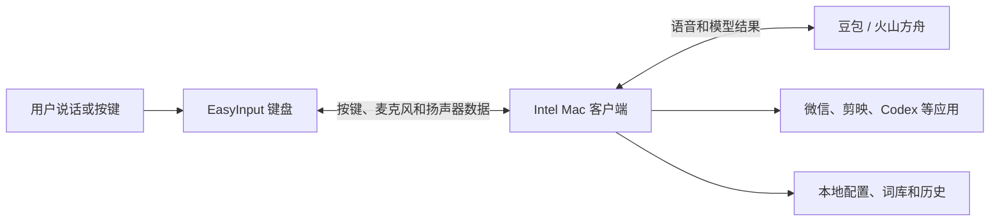
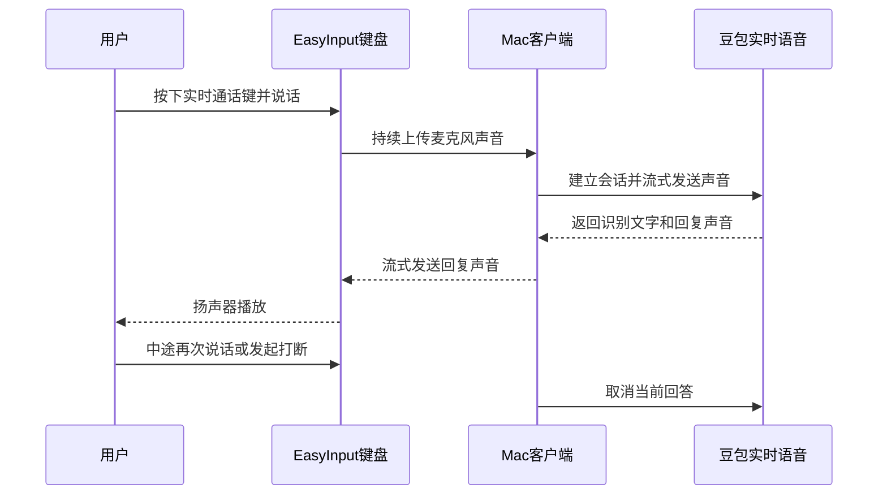

# 一个不会写 Rust 的人，怎么和 AI 一起做出了 Intel Mac 版 EasyInput

WaytoAGI 第七期 AI 训练营内部分享

副标题：从“我的电脑用不了”，到实时语音、语音打开应用

> 分享建议：约 15 分钟，共 12 页。页面只放精简内容，“演讲备注”用于现场口述。

---

## 01｜引子：因为我的电脑用不了

### 页面内容

- 我用的是一台 Intel 芯片的 Mac
- CY 老师当时提供的客户端不支持这台电脑
- 但客户端有现成的界面和流程，固件代码也是公开的
- 我就想：能不能照着这个思路，自己补一个 Intel Mac 客户端？

**说干就干，没想到最后还真干成了。**

### 演讲备注

这个项目的起点并不宏大，就是我自己的电脑用不了。

当时我的想法很朴素：老师已经把产品长什么样、怎么使用展示出来了，固件也开源了，我就有机会看懂电脑和键盘之间是怎么通信的。那我是不是可以让 AI 帮我，把缺失的 Intel Mac 客户端补出来？

一开始我只是想试试，结果从客户端界面一路做到了语音输入、实时通话，最后还能通过语音打开微信、剪映和 Codex。

---

## 02｜我最终做出了什么

### 页面内容

一个面向 Intel Mac 的 EasyInput 桌面客户端：

- 接收键盘按键和设备配置
- 语音输入、语音编辑
- 与大模型实时语音通话
- 用语音打开应用、执行快捷键
- 保存词库、历史和本机设置

**它不是一个单独的聊天页面，而是连接“键盘、AI 和 Mac”的中间控制台。**

### 演讲备注

如果只看界面，它像一个普通的桌面软件。但它真正的作用，是把三类东西接到一起：桌上的 EasyInput 键盘、云端的大模型，以及电脑上的微信、剪映、Codex 等应用。

所以这个项目最难的地方，不是做出某一个页面，而是让硬件、客户端、云端接口和 macOS 系统能力连成一条稳定的链路。

---

## 03｜整个项目的业务架构

### 页面内容



一句话概括：

**键盘负责收音和触发，AI 负责听懂和回答，Mac 客户端负责把所有事情串起来并真正执行。**

### 演讲备注

可以把它理解成一个四人小组。

用户负责提出需求；键盘负责采集声音、播放声音和发送按键；豆包负责理解、对话和生成语音；Mac 客户端是中控，它知道当前有哪些功能、该把声音送到哪里，也有权限真正打开电脑上的应用。

这里有一个很重要的边界：豆包不会直接操作我的电脑，固件也不知道什么是微信。真正打开应用的动作，始终由 Mac 客户端执行。

---

## 04｜客户端是怎么实现的

### 页面内容

| 部分 | 大白话解释 |
|---|---|
| React + TypeScript | 负责我们看到的页面和交互 |
| Tauri + Rust | 负责硬件通信、云端连接和系统操作 |
| USB HID | 负责按键触发和键盘配置 |
| 局域网 UDP | 负责实时传送开发板的声音 |
| WebSocket / HTTPS | 负责连接豆包和火山方舟 |
| JSON / SQLite / Keychain | 负责本地配置、历史和密钥安全 |

### 演讲备注

这页不需要讲代码，只需要让大家知道为什么不是做一个网页就结束。

网页很适合做界面，但这个项目还要连接 USB 键盘、收发实时音频、打开本机应用、模拟快捷键、使用 macOS 钥匙串。这些都更适合放在本地客户端里。

因此界面用 React，底层能力用 Rust。简单说就是：界面部分追求开发快，底层部分追求稳定和可控。

---

## 05｜实时语音：第一版思路为什么放弃了

### 页面内容

最初设想：

```text
语音 → ASR 转文字 → LLM 思考 → TTS 合成语音 → 播放
```

问题：

- 每一步都要等上一步，延迟会不断叠加
- 对话容易变成“你说完，我等一会儿再说”
- 用户中途插话时，停止识别、模型和播放都要自己协调
- 能做出来，但很难做到自然的实时交流

后来改用：**端到端实时语音大模型**

### 演讲备注

我最开始想到的也是最常见的方案：先把声音转成文字，再交给大模型，最后把回答转成声音。

这个方案逻辑很清楚，但有个现实问题：链路太长。每一段都快一点，合起来还是会慢。而且当模型正在说话时，用户突然插一句，究竟应该停掉哪一层、已经生成的声音怎么办，都需要自己处理。

后来查资料，我发现豆包已经提供端到端实时语音接口。声音可以持续送进去，文字理解、对话和语音输出都放在同一个实时会话里完成，也提供了取消回答的机制。这更适合做“通话”，而不是一问一答的语音按钮。

---

## 06｜一次实时语音通话是怎么跑起来的

### 页面内容



- 上行声音：16 kHz
- 下行声音：24 kHz
- 每 20 毫秒传一小段，边收、边处理、边播放

### 演讲备注

实际流程可以概括为：键盘负责把声音送上来，客户端把声音转给豆包；豆包返回的不是一整个音频文件，而是一小段一小段的声音；客户端再把它们送回键盘扬声器。

为什么要切成很小的片段？因为如果等一句话全部生成完再播放，延迟会很明显。现在是边生成边播，所以听起来更像通话。

打断的关键也不是“让模型听话”这么抽象，而是客户端明确发出取消当前回答的指令，并清掉还没播放的声音。这样用户插话后，旧回答不会继续排队播放。

---

## 07｜怎么让语音去打开第三方应用

### 页面内容

用户先在“语音调用”页面配置：

- “打开微信” → 微信.app
- “打开剪映” → VideoFusion-macOS.app
- “打开 Codex” → ChatGPT.app
- 也可以配置快捷键、复制粘贴、固定文字和语音编辑


**模型负责理解，客户端负责执行。**

### 演讲备注

这里没有把“打开微信”写死在代码里，而是做了一个可配置的映射页面。用户想加多少项都可以，根据自己的需要启用或停用。

每次新建实时语音会话时，客户端会把已启用的动作告诉豆包。豆包如果判断用户是在调用工具，就把工具名称和参数发回客户端。客户端在自己的白名单里找到对应动作，检查没问题后再真正执行。

打开应用最终使用的是 macOS 本机能力；快捷键也是客户端在电脑上执行。云端模型既拿不到任意系统权限，也不能绕过用户配置直接操作电脑。

---

## 08｜Function Calling 的正确顺序

### 页面内容

```text
① 客户端告诉豆包：我有哪些工具
② 用户说：打开微信
③ 豆包下发 function_call：请调用“打开微信”
④ 客户端真正打开微信
⑤ 客户端把成功或失败结果回传给豆包
⑥ 豆包继续用语音回答用户
```

小插曲：

**火山引擎文档里 Function Calling 示例的“输入/输出”很容易让人按反。**

- `response.function_call_arguments.done`：服务端发给客户端
- `conversation.item.create` + `role=tool`：客户端执行后回传服务端

### 演讲备注

我联调时遇到一个很容易把人带沟里的问题：文档里的输入示例和输出示例，看起来很容易站错视角。

真正要记住的不是“输入”和“输出”这两个标签，而是业务顺序：模型先要求客户端调用工具，客户端执行完成后，再把结果作为 tool 消息传回去。

如果这个方向理解反了，客户端就会一直等模型，模型也一直等客户端，表面看起来就是“说了打开微信，但既没有回答，也没有打开”。

---

## 09｜为什么一开始能用，聊一会儿又失灵

### 页面内容

真实遇到的问题：

- 刚进入通话时能打开微信、剪映，聊久后模型却说“没有可用工具”
- “剪映”“Codex”等名称偶尔识别不准
- 模型听懂了，但只给文字回答，没有调用工具
- 扬声器播出的回答又被麦克风收进去，模型把自己的话当成用户的话
- 同一个工具消息重发时，可能导致动作重复执行

**不是一个 Bug，而是识别、模型选择、声音回传和本机执行几层问题叠在一起。**

### 演讲备注

这个阶段最容易做的错误判断，是看到“没有打开微信”，就认为打开应用的代码坏了。

但真实链路里，可能是没听清，也可能是听清后没有选择工具，还可能是工具选对了但客户端执行失败。再加上开发板扬声器和麦克风离得近，模型上一轮说的话有时会被重新收进去。

所以后来我没有继续靠猜，而是在关键节点加日志：会话创建时到底加载了几个工具、识别到了什么、有没有收到 Function Call、客户端有没有执行、执行结果有没有回传。日志一完整，问题才从“玄学不稳定”变成可以逐段定位。

---

## 10｜最后怎么把语音调用做得更稳

### 页面内容

我采用了“两条路”：

| 情况 | 处理方式 |
|---|---|
| “打开微信”“打开剪映”等明确、无参数命令 | 客户端识别后直接执行 |
| “把选中的文字改得更正式”等需要理解内容的命令 | 继续交给大模型 Function Calling |

同时增加：

- 应用名热词，减少“剪映、Codex”识别错误
- 只匹配完整命令，避免聊天中提到微信就误打开
- 少量受限模糊匹配，兼容 Codex 被识别成 Kodex
- 剥离确认的扬声器回声
- 本地已经执行后，取消模型相反的普通回答
- 对重复的工具调用做去重

### 演讲备注

这次最大的技术体会是：不是所有事情都要交给大模型。

“打开微信”没有参数，也没有什么创造空间。如果已经准确识别到这句话，客户端直接执行会更快、更稳。大模型更适合处理“帮我把选中的内容翻译成英文”这类需要理解上下文、还要生成参数的任务。

所以最后不是只依赖 Function Calling，而是做成“确定的事情走确定路线，复杂的事情交给模型”。这也是语音调用从偶尔能用，变成更接近可用功能的关键。

---

## 11｜客户端、固件和云端分别负责什么

### 页面内容

| 角色 | 负责 | 不负责 |
|---|---|---|
| 固件 | 通话触发、采集麦克风、播放扬声器、保持音频连接 | 不认识微信，不执行 Function Calling |
| Mac 客户端 | 保存映射、连接云端、判断和执行本机动作、记录日志 | 不代替模型理解复杂语言 |
| 豆包实时语音 | 识别、对话、生成语音、复杂工具选择 | 不直接控制用户电脑 |

固件侧最重要的后续增强：**AEC 回声消除和稳定的全双工音频。**

### 演讲备注

把边界分清以后，很多问题就简单了。

语音调用不需要把微信路径、快捷键或 API Key 写进固件。固件继续做好它最擅长的事情：收音、放音和通话控制。所有与电脑应用有关的配置都留在 Mac 上。

固件真正值得继续优化的是声音本身，尤其是回声消除。客户端可以从文字上过滤一部分回声，但这只是补救。最理想的做法，还是让固件或音频前端利用扬声器参考信号做 AEC。

---

## 12｜这次项目给我的最大经验

### 页面内容

**人负责大的方向，具体工作交给 AI。**

但“大方向”不只是说一句需求：

- 人决定为什么做、做到什么程度
- 人划定安全边界和技术取舍
- AI 阅读资料、写代码、补测试、分析日志
- 人拿真实设备反复试，把现象说清楚
- AI 根据证据继续修改，人做最终验收

最后带走三句话：

1. 先把问题拆成一条能验证的链路
2. 遇到“不稳定”，先补日志，不要靠猜
3. 确定的事情用规则，复杂的事情再交给大模型

### 演讲备注

我以前可能会觉得，做这种项目需要先把前端、Rust、硬件协议、语音接口全部学会，才有资格开始。现在我的看法变了。

人不一定要亲手写完每一行代码，但一定要知道自己要解决什么问题，知道哪些结果算成功，还要愿意真实测试。AI 可以很快地读文档、写代码和排查问题，但它看不到我桌上的硬件，也不知道我说完“打开微信”之后到底有没有真的打开。

这次我扮演的角色，更像产品经理、技术负责人和测试员的结合体。我负责方向、判断和验收，AI 负责大量具体工作。最后真正有价值的，不只是做出了一个 Intel Mac 客户端，而是跑通了一套我以后还能继续复用的人机协作方法。

**从“我的电脑用不了”开始，到“我真的把它做出来了”——这就是这次项目最有意思的地方。**

---

## 备选现场演示

如果时间允许，可以用 2—3 分钟演示：

1. 打开 EasyInput，展示“通话”和“语音调用”两个入口。
2. 展示三个已配置映射：打开微信、打开剪映、打开 Codex。
3. 开始实时通话，先正常聊一句，再说“打开微信”。
4. 展示应用被打开，以及页面上的识别文字、工具执行状态和调用次数。
5. 最后展示诊断日志入口，说明“不稳定问题最后是怎么被定位的”。

演示前建议：

- 只启用本次要演示的三个动作，减少相似名称干扰。
- 提前确认应用路径仍然有效。
- 确认麦克风、辅助功能和输入监控权限。
- 现场环境较吵时，尽量缩短键盘扬声器与麦克风之间的回声路径。
