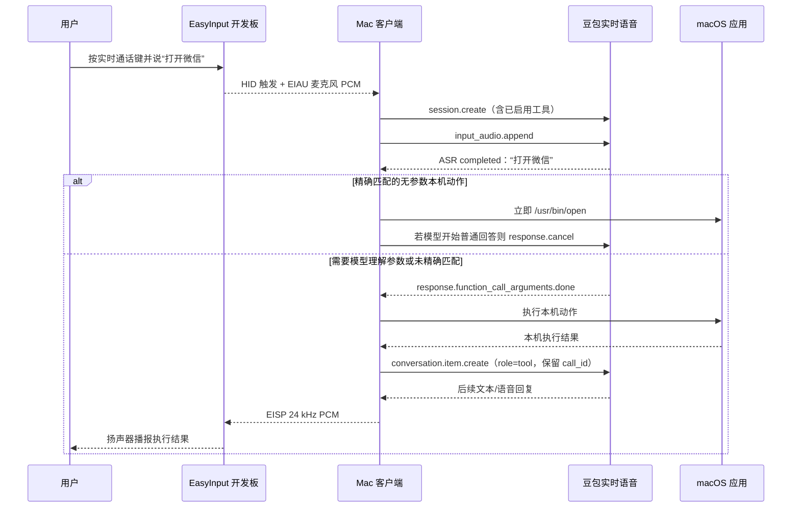
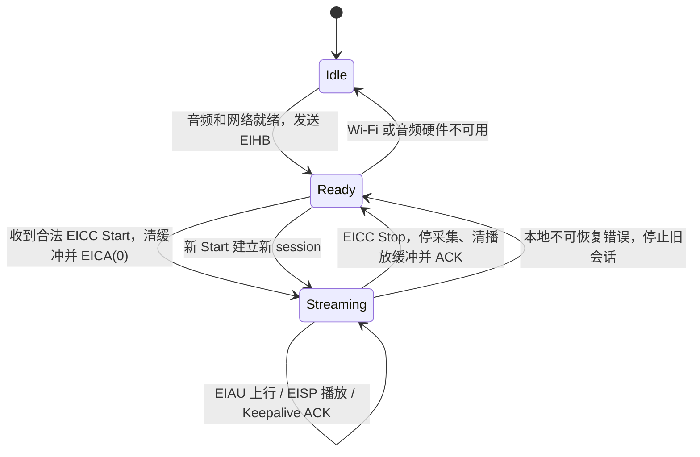

# EasyInput 语音调用：客户端与固件接口说明

> 适用版本：EasyInput 客户端 `0.1.29` 当前源码
>
> 文档日期：2026-08-30（Asia/Shanghai）
>
> 目标：说明“用户通过豆包实时语音打开应用、执行快捷键或编辑选中文本”的完整链路，以及开发板固件必须实现和不应实现的边界。

## 1. 结论

可以实现，而且当前客户端已经完成第一版。

用户在客户端“语音调用”页配置不限数量的映射。下一次实时通话开始时，客户端把每个**已启用映射**转换成一个豆包 Function Calling 工具，同时建立本地确定性指令索引。打开应用、快捷键、复制粘贴和固定文字等无需模型生成参数的明确命令，由客户端在 ASR 完成后优先精确匹配并直接执行；语音编辑等需要理解参数的动作继续由豆包选择工具和生成参数。真正的本机动作始终由 Mac 客户端执行。

固件不需要理解 Function Calling，也不保存应用路径、快捷键、工具名称、`call_id` 或 JSON Schema。固件只需要继续承担现有实时通话链路：触发通话、上传开发板麦克风 PCM、接收并播放客户端回传 PCM、处理开始/停止/保活控制。

| 能力 | 客户端 | 固件 | 豆包实时语音 |
|---|---|---|---|
| 保存语音动作列表 | 负责 | 不参与 | 不参与 |
| 判断“打开微信”等明确命令 | 精确匹配并优先执行 | 不参与 | 作为 Function Calling 后备 |
| 打开 `.app`、执行快捷键 | 负责 | 不参与 | 不直接执行 |
| 读取和替换当前选区 | 负责 | 不参与 | 生成编辑参数/文本 |
| 麦克风采集和扬声器播放 | 转发、校验、分帧 | 负责 | 接收/生成音频 |
| 实时通话键 | 监听并启动会话 | 发出触发事件 | 不参与 |
| 工具执行结果回传 | 负责 | 不参与 | 根据结果继续播报 |
| 驾驶舱模块/期次选择 | Function Calling 后切页并等待页面回执 | 不参与 | 选择受限的 `cockpit_navigate` 参数 |

如果现有固件已经正确实现本文第 5 节的实时音频协议，**Function Calling 功能本身不要求修改固件**；只需要完成兼容性复验。旧固件缺少心跳、控制 ACK、持续上行或下行播放时，才需要补齐对应模块。

驾驶舱专项结论和可直接交给固件项目执行的清单见 [开发板实时语音直控驾驶舱：固件要求](开发板实时语音直控驾驶舱-固件要求.md)。

## 2. 端到端工作流程



关键约束：

1. 映射在创建实时会话时生成工具定义；通话过程中修改映射，只在**下一次通话**生效。
2. 一个服务端事件可以包含多个 Function Call。客户端并行执行后，用一条 `conversation.item.create` 汇总结果，每项保留原始 `call_id`。
3. 客户端对相同 `call_id` 去重，避免服务端重发导致应用被重复打开或快捷键被重复按下。
4. 工具执行失败也必须回传结构化错误，让豆包可以向用户说明失败原因，而不是让会话无响应。
5. 本地路由只接受完整命令或去掉“请、帮我、一下”等礼貌词后的完整命令；“为什么不能打开微信”这类讨论不会触发动作。
6. 同一轮若豆包随后仍返回同一个工具调用，客户端保留 `call_id` 并回传已由本地执行器接管，不会重复打开应用或重复按键。

## 3. 客户端已经实现的功能

### 3.1 “语音调用”设置页

入口位于客户端顶部导航“语音调用”，源码为 `src/pages/VoiceActionsPage.tsx`。

每个映射包含：

| 字段 | 规则 | 用途 |
|---|---|---|
| `id` | UUID，客户端生成且不可重复 | 生成稳定的工具名 |
| `enabled` | 布尔值 | 只有启用项进入新实时会话 |
| `name` | 必填，最多 80 字符 | 页面展示和工具描述 |
| `description` | 最多 400 字符 | 描述可触发的自然说法和使用场景 |
| `action.kind` | 允许动作枚举 | 决定本机执行器 |
| `action.value` | 按动作选填 | 应用绝对路径、快捷键或固定文字 |

映射数量在 EasyInput 客户端中不设人为上限。实际可用数量还会受豆包服务端对会话请求大小、工具数量和描述长度的限制；映射很多时应只启用当前需要的项目，并避免名称和说明高度相似。

### 3.2 支持的本机动作

| 动作 | 客户端执行方式 | 额外条件 |
|---|---|---|
| 打开应用 `OpenApp` | `/usr/bin/open <绝对 .app 路径>` | 保存和执行时都校验应用存在 |
| 自定义快捷键 `Hotkey` | macOS CoreGraphics 键盘事件 | 需输入监控/辅助功能权限 |
| 复制、粘贴、剪切、全选、撤销 | 标准 macOS 组合键 | 目标应用必须处于前台 |
| 回车、退格 | 键盘事件 | 目标应用必须处于前台 |
| 固定文字 `FixedText` | 本机文本注入 | 最多 2,000 字符 |
| 语音编辑 `EditPtt` | 读取选区 → 火山方舟 → 替换选区 | 需要辅助功能权限和已配置的 Ark API Key |

快捷键格式为以 `+` 分隔的修饰键和一个普通键，例如 `Command+Shift+P`、`Control+Space`。保存前由 Rust 统一校验，不支持的按键不会进入配置。

### 3.3 确定性本地路由

下列无需模型生成参数的动作支持 ASR 完成后本地直调：`OpenApp`、`Hotkey`、复制、粘贴、剪切、全选、撤销、回车、退格和固定文字。匹配以启用映射的 `name` 为主；打开应用还支持“打开、启动、唤起、进入、切换到”等动词别名、“打开个微信”等口语填充词、“听得到吗”等问句尾巴，以及一轮中用逗号、“然后”等分隔的多个完整命令。

对于带有拉丁字母的应用名，本地路由允许非常有限的编辑距离匹配，例如 ASR 把 `Codex` 写成 `Kodex`、把 `TeleAgent` 写成 `tell agent` 时仍可命中。模糊匹配只用于以明确打开动词开头的应用命令，并且最佳候选必须唯一；不会对任意聊天子串做模糊执行。中文应用名还允许唯一的一字缺失，例如当前只有“微信”候选时，“打开微”可命中；若同时存在“微信”和“微博”等歧义候选则不执行。

本地直调采用完整短句匹配，不做任意子串触发。例如，“打开微信。”“请帮我打开微信一下”和“启动微信”会执行；“为什么不能打开微信？”不会执行。`EditPtt` 必须从用户话语中提取编辑要求，不进入本地直调，仍走 Function Calling。

匹配后客户端立即启动动作，并在模型开始生成普通文本或音频时发送 `response.cancel`、清理该轮扬声器队列，避免出现“无法帮你打开”之类与真实执行结果冲突的播报。日志使用 `local_action.matched` 和 `route=local_asr` 标记该链路。

开发板扬声器音频可能被麦克风再次采集，导致 ASR 文本变成“上一轮助手回复 + 用户新命令”。客户端会将转写开头与上一轮助手文字做受限相似度比对，剥离确认的回声前缀后再进行本地路由；若整轮只有助手回声，则取消后续模型回复，避免自问自答循环。日志使用 `asr.assistant_echo_removed` 和 `asr.echo_only_turn` 标记。该语义过滤不能替代固件或音频前端的 AEC。

### 3.4 Function Calling 映射

工具名不会直接使用用户填写的中文名称，而是使用稳定格式：

```text
voice_action_<去掉连字符的小写 UUID>
```

普通动作的参数 Schema 是空对象。语音编辑动作要求一个 `instruction` 字符串：

为提升“剪映”等应用名的识别稳定性，客户端还会把已启用映射的名称、去掉“打开/启动/唤起/切换到”等前缀后的名称、动作标签，以及本机词库热词，一起写入 `session.create.extension.asr.extra.context.hotwords`。同时在系统提示词末尾追加一条不可被普通聊天主题覆盖的工具规则：用户当前一句明确要求执行已配置动作时，应调用工具，而不是只做文字回答。

豆包官方协议规定，系统提示词、模型内部提示和对话上下文合计上限为 12K tokens。自定义提示词很长时，应减少无关长文；长时间聊天后若工具选择开始下降，可以结束并新建实时会话。客户端页面会显示“已加载 N 个语音动作”“正在执行/执行成功/执行失败”和累计工具调用次数，用于区分 ASR、模型选工具和本机执行三个阶段。

```json
{
  "type": "function",
  "name": "voice_action_7ec...",
  "description": "执行用户在 EasyInput 中配置的本机动作……",
  "parameters": {
    "type": "object",
    "properties": {
      "instruction": {
        "type": "string",
        "description": "用户对当前选中文本的完整编辑要求"
      }
    },
    "required": ["instruction"]
  }
}
```

客户端接收 `response.function_call_arguments.done` 后，按 `name` 找到仍然启用的本机映射，解析 `arguments`，执行动作，再回传：

```json
{
  "event_id": "event-<uuid>",
  "type": "conversation.item.create",
  "items": [
    {
      "call_id": "call_weather_001",
      "role": "tool",
      "content": [
        {
          "type": "input_text",
          "text": "{\"ok\":true,\"message\":\"应用已打开\"}"
        }
      ]
    }
  ]
}
```

这里的 `text` 是序列化后的结果 JSON。失败时返回 `ok=false` 和错误码；客户端不会把无效工具名静默当成成功。

### 3.5 配置保存和安全边界

- 配置保存在 Mac 应用数据目录的版本化 `config.json` 中，当前配置版本为 6。
- 应用绝对路径和快捷键不写入开发板，不上传为 Function Call 参数；工具描述会发送给豆包用于意图匹配。
- Realtime API Key 和 Ark API Key 保存在 macOS Keychain，不进入语音映射 JSON。
- 应用路径必须指向现存目录且以 `.app` 结尾；执行时再次校验，防止应用被移动后继续执行旧路径。
- 当前版本属于用户主动配置和启用的本机自动化。高风险动作不应伪装成普通快捷键；后续若增加文件删除、终端命令、支付或外部消息发送，应单独增加确认与权限模型。

## 4. 固件侧改动范围

### 4.1 固件必须提供

1. 能触发一次实时通话。当前配置下发使用标准键盘报告 `Ctrl+Shift+R`，客户端只处理按下沿；已有固件也可以继续发送 Hotkey App Command `EasyInputRealtime`。
2. 就绪后周期发送 `EIHB` 心跳，使客户端可以发现开发板 UDP 地址。
3. 收到 `EICC Start` 后建立新的音频会话、清理旧缓冲、返回匹配的 `EICA`。
4. 通话期间每 20 ms 发送一个 `EIAU` 上行包，音频必须是 16 kHz、单声道、PCM S16LE。
5. 接收 `EISP` 下行包，以 24 kHz、单声道、PCM S16LE 播放。
6. 正确处理 `EICC Keepalive` 和 `EICC Stop`；Stop 后立即停止采集、清理本会话播放缓冲并 ACK。
7. 不设置固定 5 分钟采集上限。只在收到 Stop、发生不可恢复硬件错误或本地安全看门狗超时时结束。
8. 校验 magic、版本、长度、session、sequence 和来源；错误包不得进入 I2S 播放或麦克风发送状态。
9. 全双工播放期间应使用扬声器参考信号做 AEC，或通过声学结构和增益控制避免扬声器内容重新进入麦克风；否则服务端会把自己的播报再次识别成用户话语。

### 4.2 固件明确不需要提供

- 不解析豆包 WebSocket 事件。
- 不生成、保存或执行 Function Calling。
- 不保存语音映射列表、macOS 应用路径或快捷键。
- 不接触 Realtime/Ark API Key。
- 不负责选择前台应用、读取系统剪贴板或选中文本。
- 不需要修改现有 2,048-byte USB 键盘配置协议来承载语音工具。

### 4.3 可选增强

- 可选用 Hotkey App Command `EasyInputRealtime` 代替 `Ctrl+Shift+R`，避免目标应用收到兼容快捷键。
- 为扬声器增加 2–5 帧的有界抖动缓冲；收到 Stop 或新 session 的 Start 时必须清空。
- 统计上行丢帧、下行乱序、播放欠载、I2S 错误，并在设备状态报告中提供诊断计数。
- 未来协议可加入随机 nonce + HMAC 或迁移到 DTLS/QUIC；当前 UDP 仅允许在可信局域网使用。

## 5. 固件 UDP 协议

所有多字节整数均为**小端序**。PCM 为 signed 16-bit little-endian、单声道。保留字段发送时必须置 0，接收时当前版本应忽略其值。

### 5.1 心跳 `EIHB`：固件 → 客户端

最小长度 20 bytes，协议版本 1。

| 偏移 | 长度 | 字段 | 值/说明 |
|---:|---:|---|---|
| 0 | 4 | magic | ASCII `EIHB` |
| 4 | 1 | version | `1` |
| 5 | 1 | flags | bit0=`streaming`，bit1=`audio_ready` |
| 6 | 2 | reserved | `0` |
| 8 | 8 | session_id | 空闲可为 0；流式状态为当前会话 |
| 16 | 4 | sequence | 单调递增，允许回绕 |

客户端最多等待 7 秒获得合法心跳，并把心跳来源 IP/端口绑定为本次会话 peer。因此固件应在就绪时持续发送，推荐间隔 1 秒。

### 5.2 控制 `EICC`：客户端 → 固件

固定 36 bytes，协议版本 1。

| 偏移 | 长度 | 字段 | 值/说明 |
|---:|---:|---|---|
| 0 | 4 | magic | ASCII `EICC` |
| 4 | 1 | version | `1` |
| 5 | 1 | action | Start=`1`，Stop=`2`，Keepalive=`3` |
| 6 | 2 | reserved | `0` |
| 8 | 8 | session_id | 当前会话 ID |
| 16 | 4 | sequence | 控制序号 |
| 20 | 16 | reserved | `0` |

### 5.3 控制确认 `EICA`：固件 → 客户端

固定 20 bytes，协议版本 1。

| 偏移 | 长度 | 字段 | 值/说明 |
|---:|---:|---|---|
| 0 | 4 | magic | ASCII `EICA` |
| 4 | 1 | version | `1` |
| 5 | 1 | action | 回显被确认的 action |
| 6 | 1 | status | `0` 成功；非 0 为固件错误码 |
| 7 | 1 | reserved | `0` |
| 8 | 8 | session_id | 必须回显控制包 session |
| 16 | 4 | sequence | 必须回显控制包 sequence |

客户端等待 Start ACK 的超时为 3 秒。session 或 sequence 不匹配的 ACK 会被忽略。

建议固件状态码：`0` 成功、`1` 音频硬件未就绪、`2` 会话冲突、`3` 参数不支持、`4` 内部错误。客户端当前会展示非零数字；固件团队应冻结含义后保持兼容。

### 5.4 上行音频 `EIAU`：固件 → 客户端

固定为 32-byte 头 + 640-byte PCM，共 672 bytes。注意：该报文当前协议版本是 **2**。

| 偏移 | 长度 | 字段 | 必须值 |
|---:|---:|---|---|
| 0 | 4 | magic | ASCII `EIAU` |
| 4 | 1 | version | `2` |
| 5 | 1 | header_len | `32` |
| 6 | 1 | sample_format | `1`，PCM S16LE |
| 7 | 1 | channels | `1` |
| 8 | 8 | session_id | 当前会话 ID |
| 16 | 4 | sequence | 每帧递增，允许回绕 |
| 20 | 4 | sample_rate | `16000` |
| 24 | 4 | timestamp_ms | 设备单调时钟毫秒值 |
| 28 | 2 | frame_samples | `320` |
| 30 | 2 | payload_len | `640` |
| 32 | 640 | payload | 20 ms PCM |

客户端会拒绝版本、声道、采样率、帧样本数或长度不匹配的包。启动 ACK 成功前不应发送当前会话音频；Stop 后不得继续发送旧 session 的包。

### 5.5 下行音频 `EISP`：客户端 → 固件

固定为 32-byte 头 + 960-byte PCM，共 992 bytes，协议版本 1。

| 偏移 | 长度 | 字段 | 必须值 |
|---:|---:|---|---|
| 0 | 4 | magic | ASCII `EISP` |
| 4 | 1 | version | `1` |
| 5 | 1 | header_len | `32` |
| 6 | 1 | sample_format | `1`，PCM S16LE |
| 7 | 1 | channels | `1` |
| 8 | 8 | session_id | 当前会话 ID |
| 16 | 4 | sequence | 每帧递增，允许回绕 |
| 20 | 4 | sample_rate | `24000` |
| 24 | 2 | frame_samples | `480` |
| 26 | 2 | payload_len | `960` |
| 28 | 4 | reserved | `0` |
| 32 | 960 | payload | 20 ms PCM |

固件只播放当前活动 session 的包。建议根据 sequence 丢弃重复或明显过期包，并保持播放缓冲有界；实时语音优先低延迟，不应为了补齐陈旧音频无限增长队列。

### 5.6 固件联调 Golden Vector

以下示例使用 `session_id=0x0102030405060708`、`sequence=9`。可用来确认 magic、端序和保留位。空格仅用于阅读。

Start 控制包必须是 36 bytes：

```text
45 49 43 43  01 01 00 00  08 07 06 05 04 03 02 01
09 00 00 00  00 00 00 00 00 00 00 00 00 00 00 00 00 00 00 00
```

成功 ACK 必须是 20 bytes：

```text
45 49 43 41  01 01 00 00  08 07 06 05 04 03 02 01
09 00 00 00
```

上行 `EIAU` 头部示例使用 `timestamp_ms=1234`，头后必须再跟 640 bytes PCM：

```text
45 49 41 55  02 20 01 01  08 07 06 05 04 03 02 01
09 00 00 00  80 3e 00 00  d2 04 00 00 40 01 80 02
```

下行 `EISP` 头部后必须再跟 960 bytes PCM：

```text
45 49 53 50  01 20 01 01  08 07 06 05 04 03 02 01
09 00 00 00  c0 5d 00 00  e0 01 c0 03 00 00 00 00
```

## 6. 固件状态机建议



伪代码：

```c
on_udp_packet(packet, peer) {
    if (packet.magic == "EICC" && valid_v1_control(packet)) {
        if (packet.action == START) {
            stop_capture();
            clear_speaker_queue();
            active_session = packet.session_id;
            if (start_capture_16k_mono_s16le()) {
                streaming = true;
                send_eica(peer, START, 0, active_session, packet.sequence);
            } else {
                streaming = false;
                send_eica(peer, START, 1, active_session, packet.sequence);
            }
        } else if (packet.action == KEEPALIVE && packet.session_id == active_session) {
            send_eica(peer, KEEPALIVE, 0, active_session, packet.sequence);
        } else if (packet.action == STOP && packet.session_id == active_session) {
            streaming = false;
            stop_capture();
            clear_speaker_queue();
            send_eica(peer, STOP, 0, active_session, packet.sequence);
            active_session = 0;
        }
        return;
    }

    if (packet.magic == "EISP" && valid_speaker_packet(packet)
        && streaming && packet.session_id == active_session) {
        enqueue_bounded_20ms_pcm(packet.payload, packet.sequence);
    }
}

every_20ms() {
    if (streaming) send_eiau(active_session, next_sequence(), microphone_pcm_320);
}

every_1s() {
    send_eihb(streaming, audio_ready, active_session, heartbeat_sequence++);
}
```

## 7. 触发协议与现有 USB 兼容

当前设备 USB 标识为 VID `0x303A`、PID `0x1006`。客户端兼容两种实时通话触发：

1. 当前下发方式：发送标准键盘报告 `Ctrl+Shift+R`。HID modifier 的 Ctrl 与 Shift 位必须同时置位，键码数组包含 HID Usage `0x15`（R）。客户端只响应按下沿。
2. 可选专用方式：固件发送 Hotkey 类型的 App Command，名称为 `EasyInputRealtime`。

`EasyInputRealtime` App Command 使用 64-byte HID Input Report，布局如下：

| 偏移 | 长度 | 字段 | 值/说明 |
|---:|---:|---|---|
| 0 | 1 | Report ID | `0x11` |
| 1 | 1 | kind | `0x02`，Hotkey |
| 2 | 1 | index | `0` |
| 3 | 1 | total | `1` |
| 4 | 1 | data_len | `18` |
| 5 | 1 | state | 按下=`1`，释放=`2` |
| 6 | 17 | hotkey UTF-8 | ASCII `EasyInputRealtime` |
| 23 | 41 | padding | `0` |

固件应先发送按下报告，再发送释放报告。客户端会对 120 ms 内完全相同的 App Report 去重，并根据状态边沿触发；不要只重复发送按下包来表示开关。

控制动作应按 `(action, session_id, sequence)` 做幂等处理。客户端在正常收尾和兜底清理中可能再次发送 Stop；重复 Stop 必须安全返回，不能重启音频硬件或污染下一会话。客户端 `0.1.29` 只把 Start ACK 作为启动门槛，Keepalive/Stop ACK 暂不作为会话失败条件，但固件仍应回包，便于后续诊断和协议升级。

语音工具映射与键盘 8 键映射是两套配置：

- 键盘映射仍通过 64-byte USB Feature Report `0x10` 分片同步到固件，最大 JSON 为 2,048 bytes。
- 语音工具映射只写入 Mac `config.json`，不会通过 USB 下发。
- 固件只需要把某个实体键配置为“实时通话”，不需要知道本次自然语言最终会打开哪个应用。

## 8. 异常处理与恢复

| 场景 | 客户端行为 | 固件要求 |
|---|---|---|
| 7 秒没有 `EIHB` | 启动失败并提示检查 Wi-Fi/端口 | 就绪时持续发心跳 |
| Start 后 3 秒无匹配 `EICA` | 关闭云会话并报错 | 及时 ACK，原样回显 session/sequence |
| 错误来源 IP | 丢弃 | 不依赖广播漂移 peer |
| 错误 session | 丢弃 | Start/Stop 时切换并清理旧 session |
| 上行暂停超过 1 秒 | 客户端向云端 mute；恢复帧后 unmute | 不发送伪造空包；修复采集断流 |
| 用户打断豆包 | 客户端发送 `response.cancel` | 继续接受后续 EISP；播放队列保持有界 |
| 用户停止 | 发送 EICC Stop 和云端 session.close | 停采集、清下行队列并 ACK |
| 应用被移动或删除 | 工具返回 `ACTION_FAILED` | 不参与 |
| macOS 权限不足 | 工具返回失败并由豆包播报 | 不参与 |
| 未知或重复 `call_id` | 返回错误或去重 | 不参与 |

当前协议没有单独的“清除正在播放音频”opcode。固件不要自行发明不兼容控制码。Stop 和新 Start 必须清空播放队列；通话内打断依靠客户端停止继续入队，以及固件使用小型有界缓冲来快速耗尽旧音频。若未来要做到严格的毫秒级清队列，应在协议 v2 中共同增加显式动作并同时升级两端。

## 9. 联调与验收用例

### 9.1 不接开发板的客户端自动验收

- 新增、编辑、删除、启用和禁用映射后能持久化。
- 至少保存 128 个映射，客户端不做数量截断。
- 非 UUID、重复 ID、空名称、无效 `.app`、非法快捷键和超长固定文字保存失败。
- 每个启用映射生成唯一工具名；禁用映射不进入 `session.create`。
- 一次返回两个 Function Call 时，两项都执行，并在一次结果事件中保留各自 `call_id`。
- 相同 `call_id` 重发时不重复执行。

### 9.2 实板协议验收

| 编号 | 操作 | 预期结果 |
|---|---|---|
| FW-01 | 固件启动并联网 | 客户端 7 秒内收到合法 `EIHB` |
| FW-02 | 客户端发送 Start | 3 秒内收到 session/sequence 匹配且 status=0 的 `EICA` |
| FW-03 | 持续说话 10 分钟 | 每 20 ms 上行 672-byte `EIAU`，无固定 5 分钟中止 |
| FW-04 | 豆包连续回复 | 固件按 20 ms 播放 992-byte `EISP`，无明显持续欠载 |
| FW-05 | 注入错误版本/长度/采样率 | 错误包被拒绝，不进入云端或扬声器 |
| FW-06 | 注入错误 session/来源 | 包被丢弃，当前会话不受影响 |
| FW-07 | Stop 后继续注入旧 EISP | 固件不播放旧会话音频 |
| FW-08 | 通话期间说“打开 Safari” | Mac 打开 Safari，开发板播报模型后续回复 |
| FW-09 | 通话期间说“复制当前内容” | 前台应用执行 Command+C，固件无需收到工具细节 |
| FW-10 | 断网后恢复 | 当前会话明确失败；恢复网络后新会话可正常建立 |

### 9.3 发布验收

- 在 macOS 12 Intel 真机授予麦克风、输入监控、辅助功能和本地网络权限。
- 验证常用应用：Safari、微信、Word/Pages、VS Code。
- 验证容易混淆的映射不会误调用；名称冲突时修改说明后重建会话。
- 检查日志不包含 API Key、Wi-Fi 密码、完整选区敏感文本或完整工具结果。
- 固件版本、客户端版本和 UDP 协议版本记录到联调报告。

## 10. 实时语音诊断日志

客户端会把实时语音关键节点持续写入 JSON Lines 文件，并在“实时通话”页提供“导出诊断日志”按钮。默认路径由 macOS 应用数据目录决定，页面底部会显示当前日志大小；不需要从终端启动应用才能保留日志。

日志按 `sessionId` 和 `turn` 关联，覆盖以下节点：

- 会话启动、开发板心跳和 Start ACK。
- `session.create` 实际下发的工具名称、工具 ID、动作类型、指令长度和 ASR 热词上下文是否存在。
- 每轮 ASR 最终文本 `asr.completed`。
- Function Call 的工具名、`call_id`、参数摘要、重复调用过滤情况。
- 本机动作开始、成功或失败，以及工具结果是否成功回传豆包。
- 每轮模型最终文字、`response.done`、云端错误、连接关闭和会话汇总。

为了控制体积，当前文件达到 5 MiB 时轮转为 `realtime.jsonl.1`，只保留一份上一代文件。日志不记录 API Key、Wi-Fi 密码或原始 PCM/Base64 音频；用户和模型文本、Function Call 参数只保留最多 240 个字符的诊断摘要。

复现“先聊天、再打开应用失败”后，应立即结束通话并导出日志。排查时重点对照同一 `turn`：

1. `asr.completed` 是否正确识别“打开微信/剪映”。
2. 是否出现 `function_call.received`；没有则说明模型该轮未选择已下发工具。
3. 出现调用后检查 `tool.execution_succeeded` / `tool.execution_failed`。
4. 检查 `tool.results_sent`，确认执行结果已回传。
5. 若模型说“没有配置工具”，对照 `session.create.sent.tools` 与该轮 `response.text_done`，即可判断工具是否确实随会话下发以及模型当时的回复。

## 11. 后续扩展接口的建议

“打开应用”和“快捷键”适合完全本地执行。未来若要用语音调用天气、股票、智能家居、企业系统等外部接口，应继续由客户端或受控业务网关实现，而不是放进固件：

1. 每个接口声明独立的参数 Schema、权限范围、超时和幂等键。
2. 只允许预注册的 HTTPS 域名，Token 放 Keychain，不允许用户语音直接拼接任意 URL 或命令。
3. 查询类动作可直接执行；发送消息、下单、删除、转账等有副作用动作必须二次确认。
4. 使用 `call_id` 贯穿请求、结果和审计记录；重试必须保证不会重复产生副作用。
5. 工具结果限制长度并脱敏后再回传豆包，避免把本机隐私或企业密钥带入模型上下文。

该扩展不改变固件职责：固件仍然只提供可靠的人机语音入口和音频输出终端。
