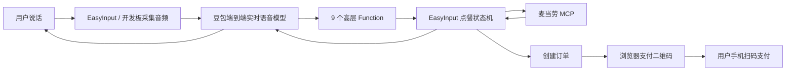

# 麦当劳 MCP 语音点餐：小白完整说明

## 1. 这套功能解决什么问题

用户不需要在点餐页面里反复点击，而是直接对 EasyInput 说：

> 帮我点麦当劳外送。

系统随后通过语音询问配送地址、门店、餐品和数量。用户听完最终价格并明确说出“确认下单”后，系统才创建订单。支付仍由用户本人在浏览器二维码页面完成，EasyInput 不会自动扣款。

这套方案把三种能力串在了一起：

- **端到端语音模型**：听懂用户说的话，并用语音回答。
- **Function Calling**：模型决定下一步应该调用哪个受控函数。
- **麦当劳 MCP**：查询真实地址、门店、菜单和价格，并创建订单。

## 2. 先认识几个名词

### MCP 是什么

MCP 可以理解为一套让大模型调用外部服务的统一接口。麦当劳 MCP 提供了查询地址、查询门店、查询菜单、计算价格、创建订单和查询订单状态等工具。

### Function Calling 是什么

Function Calling 是模型发出的结构化操作请求。例如，用户说“选择第二个地址”，模型不会自己拼接地址 ID，而是调用：

```json
{
  "name": "mcd_select_address",
  "arguments": {
    "choice": 2
  }
}
```

EasyInput 收到这个请求后，从当前会话保存的地址列表中查出第二项，再调用麦当劳 MCP。模型只接触序号，不接触真实的内部 ID。

### 为什么还需要 EasyInput 状态机

点餐不是一次问答。地址、门店、菜单、购物车、报价和订单彼此依赖，必须按顺序处理。EasyInput 在 Rust 客户端中保存每个语音会话的点餐状态，防止模型跳步或混用上一次会话的数据。

## 3. 整体架构



各部分的职责如下：

| 部分 | 负责什么 | 不负责什么 |
|---|---|---|
| 语音模型 | 理解自然语言、选择函数、播报结果 | 不保存 Token，不直接拼接内部 ID |
| EasyInput | 会话状态、参数校验、MCP 调用、安全确认、日志 | 不替用户付款 |
| 麦当劳 MCP | 返回真实业务数据、算价、创建和查询订单 | 不负责语音交互 |
| 浏览器二维码页 | 把官方支付链接转换成手机可扫二维码 | 不嵌入支付页，不保存支付链接 |

## 4. 开始前需要准备什么

### 软件环境

- macOS 12 或更高版本。
- Node.js 与 Rust/Tauri 开发环境。
- 已能正常运行 EasyInput。
- 已配置豆包端到端实时语音服务。

### 麦当劳 MCP Token

1. 打开麦当劳 MCP 平台：<https://open.mcd.cn/mcp>。
2. 登录并激活个人 Token。
3. 在 EasyInput 左侧进入“麦当劳外送”页面。
4. 把 Token 粘贴到“MCP Token”。
5. 点击“测试连接”。
6. 连接成功后启用语音点餐并保存。

Token 会写入 macOS Keychain，不会进入项目文件或 `config.json`。麦当劳服务地址固定为：

```text
https://mcp.mcd.cn
```

## 5. 怎样启动开发版

打开终端，执行：

```bash
cd "/Users/macforai/Documents/ChatGPT/easyinput"
npm run tauri dev
```

看到 Vite 和 Rust 均启动成功后，EasyInput 原生窗口会出现。不要只运行 `npm run dev` 来验证 Keychain、麦克风、全局输入或二维码功能，因为浏览器模式不具备这些原生能力。

## 6. 一次完整语音点餐怎样发生

### 第一步：开始点餐

用户说：

> 帮我点麦当劳外送。

模型调用 `mcd_start_delivery`。EasyInput 初始化 MCP，并调用 `delivery-query-addresses` 读取账号中已经保存的配送地址。

### 第二步：选择地址

模型播报地址选项时只说序号和区/县级区域（例如“第一个，西湖区”），用户只需要说“第一个”或“第二个”。语音不会读出小区、街道、楼栋、房间号、联系人或手机号；这些详细地址仅由客户端本地保留用于向麦当劳提交配送订单。

模型调用 `mcd_select_address`。EasyInput 根据序号取得真实 `addressId`，随后调用 `delivery-query-stores` 查询可配送门店。

### 第三步：选择门店

模型播报门店列表。用户选择序号后，EasyInput 调用 `query-meals` 加载该门店的实时菜单。

外送参数固定为：

```json
{
  "orderType": 2,
  "beType": 2
}
```

`storeCode` 和 `beCode` 必须来自同一家门店，不能混用。

### 第四步：搜索餐品

用户说想吃的商品名称，例如“麦辣鸡腿堡”。模型调用 `mcd_search_products`。

搜索规则：

1. 优先完整关键词匹配。
2. 没有精确结果时才返回相近餐品。
3. 模糊候选至少覆盖一半关键词，并且不少于两个不同字符。
4. 相近结果会明确提示“没有找到名称完全匹配的餐品”。

这样可以避免搜索“鸡腿堡”时，只因为名称包含一个“堡”字就返回猪柳堡等无关结果。

### 第五步：确认餐品详情

用户选择餐品序号后，EasyInput 调用 `query-meal-detail`。

`supportModify=true` 只表示餐品允许去酱、去生菜等操作，不代表用户必须定制。系统会检查套餐 `rounds` 和特制 `modification`：

- 如果必选组已经有默认选项，就按服务端默认配置加入购物车。
- 如果某个必选组没有默认值，当前 MVP 会停止并提示改选。
- 当前版本暂不支持通过语音逐项选择饮料、配餐、去冰或少酱。

### 第六步：计算最终价格

购物车确认后，EasyInput 调用 `query-store-coupons` 和 `calculate-price`。

麦当劳接口的金额单位并不统一：

| 来源 | 示例 | 单位 |
|---|---:|---|
| `query-meals.currentPrice` | `"11.5"` | 元 |
| `calculate-price.productPrice` | `1150` | 分 |
| `calculate-price.deliveryPrice` | `600` | 分 |
| `calculate-price.price` | `1830` | 分 |

菜单价格不能再除以 100；报价接口的整数金额则需要除以 100 后展示。

模型必须完整播报：商品、数量、商品金额、配送费、打包费、优惠、总价、门店和区/县级配送地址标签。不得播报小区、街道、楼栋、房间号、联系人或手机号。

### 第七步：安全确认

只有用户在当前一轮明确说出：

> 确认下单。

模型才能调用 `mcd_submit_order`。下面这些表达不会通过：

- “可以。”
- “就这样吧。”
- “不要确认下单。”
- 上一轮说过“确认下单”，但本轮没有再次确认。

报价超过 2 分钟后，系统会重新算价并要求再次确认。

### 第八步：创建订单与显示二维码

EasyInput 调用 `create-order`。成功后读取 `orderId`、`payH5Url`、订单状态、金额和支付截止时间。

系统不会把原始 `payH5Url` 交给模型，而是在本机启动一个临时页面：

- 只监听 `127.0.0.1`。
- 使用随机端口和随机路径。
- 页面约 15 分钟后停止服务。
- 二维码内容是官方 HTTPS 支付链接，不是本机地址。
- 页面不嵌入支付 iframe，也不会自动支付。

用户用手机扫描二维码，在官方支付页核对订单和金额后自行付款。

### 第九步：查询订单状态

用户支付后可以说：

> 查一下刚才订单状态。

模型调用 `mcd_check_order`，EasyInput 再调用 `query-order` 获取最新状态。

## 7. 9 个高层语音函数

| 高层函数 | 用户意图 | 主要底层 MCP 调用 |
|---|---|---|
| `mcd_start_delivery` | 开始外送点餐 | `delivery-query-addresses` |
| `mcd_select_address` | 选择地址序号 | `delivery-query-stores` |
| `mcd_select_store` | 选择门店序号 | `query-meals` |
| `mcd_search_products` | 搜索商品 | 本地实时菜单搜索 |
| `mcd_add_simple_item` | 选择商品和数量 | `query-meal-detail` |
| `mcd_quote_order` | 查看最终费用 | `query-store-coupons`、`calculate-price` |
| `mcd_submit_order` | 明确确认后创建订单 | `create-order` |
| `mcd_check_order` | 查询刚才的订单 | `query-order` |
| `mcd_reset_order` | 放弃或重新开始 | 清空本地会话状态 |

## 8. 为什么模型只能传序号

如果让模型直接传 `addressId`、`storeCode` 或 `productCode`，模型可能使用过期值或生成不存在的编码。EasyInput 采用“序号代理”方式：

1. MCP 返回真实列表。
2. EasyInput 保存列表，并只把 1、2、3 等选项交给模型。
3. 用户说出序号。
4. EasyInput 在本地把序号还原为真实 ID。

这样既减少模型出错，也避免在对话中暴露内部业务标识。

## 9. 实现过程中遇到的关键问题

### 地址显示成“已保存地址”

真实地址字段是 `fullAddress`，早期代码只识别 `address`、`addressName` 和 `name`。增加 `fullAddress` 后可以正确播报脱敏地址。

### 明明有门店，却提示无法配送

`delivery-query-stores` 的真实 `data` 直接是数组，早期解析器却只查找 `stores` 或 `storeList` 包装字段。兼容根数组后，同一地址实测返回 3 家可配送门店。

### 菜单为空

真实 `meals` 是以商品编码为 key 的对象映射，不是数组。系统会把 key 补成餐品的 `code`，再统一转换成列表。

### 价格显示为 0.22 元

菜单中的 `currentPrice="22"` 已经表示 22 元。早期逻辑错误地再次除以 100。现在菜单价按元展示，最终报价按分转换。

### 所有商品都提示需要定制

早期代码把 `supportModify=true` 当成“必须修改”。真实数据表明它通常只是允许去生菜或去酱。现在系统检查最小选择数量和默认项，只拦截真正缺少默认值的必选组。

### 二维码页偶发 404

HTTP 请求头可能分多次到达。本机服务器早期只读取一次 TCP 数据，偶尔只读到半个路径。现在会持续读取到完整的 `\r\n\r\n`，并限制请求头最大长度。

## 10. 怎样看诊断日志

在“通话”页面点击“导出诊断日志”，或直接查看：

```text
~/Library/Application Support/pro.easyinput.desktop.intel/logs/realtime.jsonl
```

建议按一次会话的 `sessionId` 从上到下查看。重点事件：

| 事件 | 看什么 |
|---|---|
| `mcd.session.initialized` | MCP 是否初始化成功、协议是否正确 |
| `mcd.workflow.step_started` | 当前地址、门店、菜单、购物车和报价状态 |
| `mcd.mcp.request` | 调用了哪个工具，脱敏参数是否正确 |
| `mcd.mcp.response` | 耗时、业务状态、数据类型和字段结构 |
| `mcd.address.selected` | 用户实际选择了哪个地址序号 |
| `mcd.stores.loaded` | 返回门店数量及门店编码配对 |
| `mcd.menu.loaded` | 菜单是否加载、规范化后有多少餐品 |
| `mcd.products.searched` | 查询词、精确或模糊匹配、候选及价格单位 |
| `mcd.product.detail_loaded` | 默认配置是否完整、是否有未满足的必选组 |
| `mcd.quote.ready` | 商品、费用和报价有效期 |
| `mcd.order.created` | 订单是否创建、二维码是否打开 |
| `mcd.mcp.failed` | HTTP、协议或网络失败 |
| `mcd.mcp.business_error` | MCP 返回的业务错误 |

日志不会记录 Token、完整地址 ID、完整订单号或原始支付链接。地址只记录脱敏预览和稳定指纹。

## 11. 常见问题排查

### “麦当劳 MCP Token 为空”

进入“麦当劳外送”页面重新填写 Token，点击保存和测试连接。不要填写 `Bearer ` 前缀。

### “这个地址当前没有可配送门店”

先检查 `mcd.mcp.response` 中 `delivery-query-stores` 的 `data.type` 和 `length`。如果长度大于 0，但 `mcd.stores.loaded.count` 为 0，说明返回结构发生变化；如果两个位置都为 0，再到麦当劳官方应用确认地址和营业时间。

### 搜索不到手机上看到的商品

手机端活动价、麦麦省待领取优惠、外送和到店渠道、门店以及早餐/正餐时段可能不同。应以当前 MCP 的门店菜单和最终 `calculate-price` 为准，不能根据手机截图编造商品编码或价格。

### “报价已超过 2 分钟”

重新说“计算一下最终价格”，听完新报价后再次明确说“确认下单”。

### 创建订单后没有二维码

查看 `mcd.order.created` 中的 `qrOpened` 和 `paymentHost`，再检查默认浏览器是否被系统拦截。二维码页只在 EasyInput 进程存活期间有效。

### `cargo run` 提示有多个 binary

当前项目应只有 `easyinput` 主程序。先确认没有遗留临时诊断二进制，再运行：

```bash
npm run tauri dev
```

## 12. 安全边界

- Token 只保存在 macOS Keychain。
- MCP 域名固定为 `https://mcp.mcd.cn`。
- 模型只能使用列表序号，不能指定内部 ID。
- 每个实时语音会话有独立状态和异步锁。
- 创建订单前必须重新播报价格，并校验当前轮 ASR 的“确认下单”。
- 每个会话只允许尝试创建一次订单，不自动重试。
- EasyInput 不自动领取优惠券、不创建新地址、不自动支付。
- 支付二维码页只绑定本机回环地址，并设置禁止缓存和内容安全策略。

## 13. 已完成的生产验证

项目已经完成以下验证：

- 使用真实已保存地址查询到 3 家可配送门店。
- 兼容真实地址、门店和菜单结构。
- 验证菜单价格和最终报价使用不同单位。
- 验证带默认套餐/特制信息的商品可以按默认配置计价。
- 使用“脆薯饼 × 1”创建过一笔真实未支付测试订单。
- 测试订单商品 9.50 元、配送 6.00 元、打包 0.80 元，总价 16.30 元。
- `create-order` 成功返回支付链接，浏览器二维码页返回 HTTP 200，支付域名为 `m.mcd.cn`。
- 测试没有自动付款。

## 14. 当前限制与下一步

当前 MVP 已经证明“语音理解、工具调用、多轮状态、真实算价、确认下单、二维码支付交接”可行。继续产品化时，建议依次补齐：

1. 语音逐项选择套餐和特制内容，并把完整 `roundList`、`modification` 传入算价和下单。
2. 让用户明确授权后领取或选择优惠券。
3. 增加购物车删除、修改数量和更换门店能力。
4. 完成真实付款后的 `query-order` 状态延迟测试。
5. 根据生产样本建立支付域名白名单。

## 15. 一段可以直接照着测试的对话

```text
用户：帮我点麦当劳外送。
系统：请选择配送地址。1. ……；2. ……
用户：第一个。
系统：请选择配送门店。1. ……；2. ……
用户：第一家。
系统：已加载菜单，请问想吃什么？
用户：搜索脆薯饼。
系统：1. 脆薯饼，9.50 元。请选择序号。
用户：第一个，一份。
系统：已加入脆薯饼一份。
用户：计算最终价格。
系统：商品 9.50 元，配送 6.00 元，打包 0.80 元，合计 16.30 元。是否确认下单？
用户：确认下单。
系统：订单已创建，浏览器已经打开支付二维码，请自行扫码支付。
```

测试真实下单时，即使只是验证页面，也要先核对地址、门店、商品和最终金额。不要在没有支付意图时说“确认下单”。
